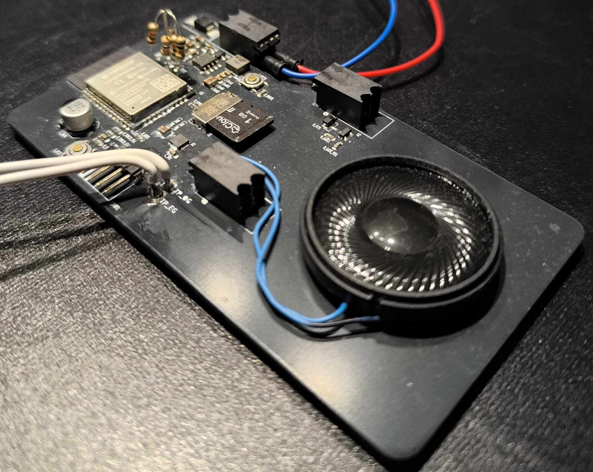
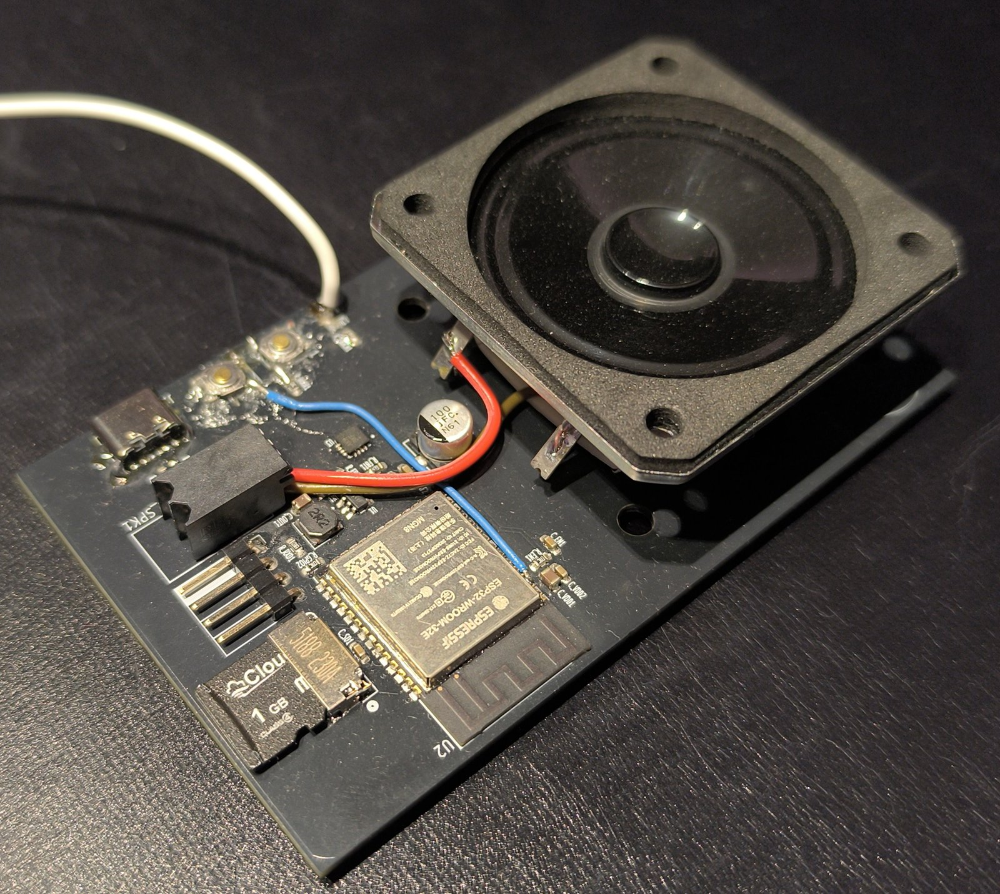
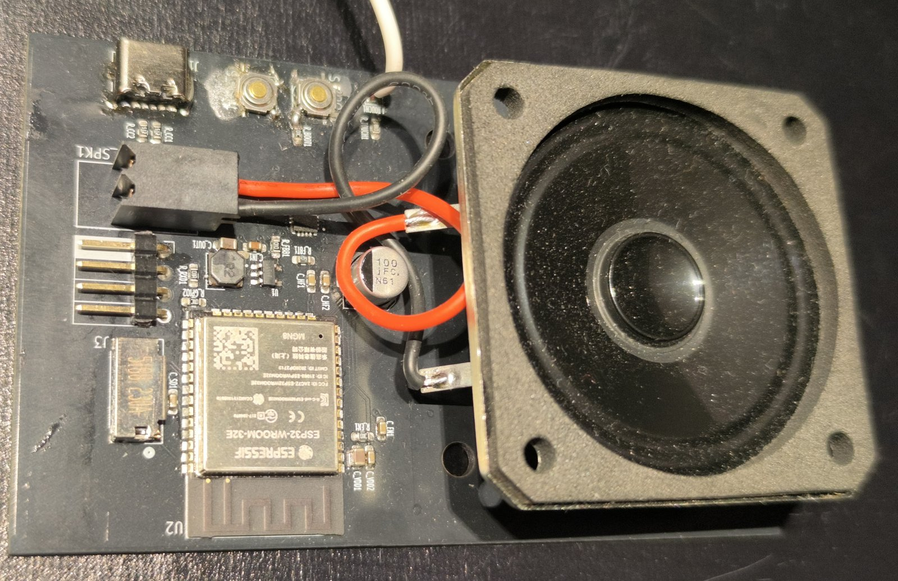
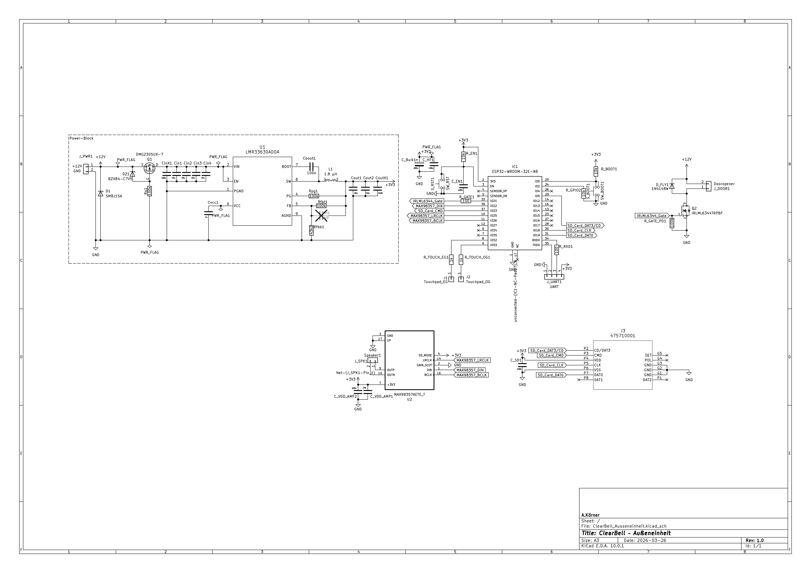

# ClearBell — Smart-Doorbell (ESP32, Hardware + Firmware)

Selbst entwickeltes Türklingelsystem für ein Zweifamilienhaus — vollständig
eigenentwickelt von der Schaltung über das PCB-Layout bis zur Firmware.
Das Projekt dokumentiert nicht nur *was* gebaut wurde, sondern die
**begründeten Technikentscheidungen** dahinter.

> Leitsatz des Projekts: **„Keep it simple, but working."**




---

## Überblick

Eine **Außeneinheit** an der Haustür und zwei baugleiche **Inneneinheiten**
(je eine pro Wohnung, EG/OG). Klingeln und Türöffnen laufen als quittierte,
gegen Replay abgesicherte Transaktionen über WLAN/UDP.

| Merkmal | Umsetzung |
|---|---|
| Controller | ESP32-WROOM-32E-N8 (beide Einheitstypen) |
| Stromversorgung außen | 12 V SELV → 3,3 V, LMR33630 Step-Down |
| Stromversorgung innen | USB-C 5 V → 3,3 V, TLV62568 Step-Down |
| Bedienung | Kapazitive Touch-Taster (ESP32 Touch, externe Bronze-Elektroden) |
| Audio | MAX98357A I2S Class-D + Visaton-Lautsprecher, WAV von SD-Karte |
| Türöffner | IRLML6344 Low-Side-Switch |
| Kommunikation | WLAN + UDP über Heim-Router, HMAC-SHA256-authentifiziert |
| Benachrichtigung | Smartphone-Push via ntfy.sh (optional, Best-Effort) |

---

## Warum das Repo interessant ist

Kein zusammengestecktes Breadboard-Bastelprojekt, sondern ein durchgezogener
Entwicklungsprozess mit dokumentierten Abwägungen. Beispiele:

- **Funkstrecke real validiert statt angenommen.** ESP-NOW war gesetzt und
  wurde nach systematischer RSSI-Messung an den echten Montageorten
  **verworfen** — die Direktstrecke war dort funktional tot. Ergebnis:
  Umstieg auf WLAN/UDP über den Router als besser positionierten Relay.
  Siehe [`docs/Funkvalidierung_ESPNOW.md`](docs/Funkvalidierung_ESPNOW.md).
- **Bibliothekswahl aus Hardware-Randbedingung.** Der verbaute
  ESP32-WROOM-32E-**N8** hat kein PSRAM; die gängige `ESP32-audioI2S`-Lib
  setzt PSRAM voraus. Lösung: eigener WAV-Player über `ESP_I2S` mit
  1-KB-Chunk-Streaming direkt von SD.
- **Analoge Realität im Layout beachtet.** DC-Bias-Derating bei X7R-Keramik
  (10 µF/25 V bei 12 V ≈ 2,8 µF effektiv) → bewusste Parallelschaltung.
- **Sicherheitsdenken über die Netzgrenze hinaus.** WPA2 sichert nur das
  Netz; der Türbefehl selbst ist zusätzlich per HMAC-SHA256 mit rollierendem
  Zähler (NVS) gegen Replay abgesichert.

Die vollständige Begründungskette liegt in
[`docs/Designentscheidungen.md`](docs/Designentscheidungen.md).

---

## Repo-Struktur

```
clearbell/
├── firmware/              ESP32-Firmware (Arduino Core 3.x)
│   ├── ClearBell_produktiv/   Produktivfirmware (Außen/Innen per #define)
│   │   ├── ClearBell_produktiv.ino
│   │   └── config.example.h   → nach config.h kopieren und ausfüllen
│   ├── common/                Gemeinsames Protokoll (clearbell_protocol.h)
│   ├── Testsketche/           Inkrementelle Bring-up-Tests (I2S, SD, UDP, HMAC …)
│   ├── tools/                 MAC-Reader, Bring-up-Programm
│   ├── sounds/                Generator für die Klingel-/Feedbacktöne
│   ├── README_Firmware.md     Detaillierte Firmware-Architektur
│   └── Ablaufplan_Firmware.md
├── hardware/              KiCad-Projekte
│   ├── Ausseneinheit/         Schaltplan + PCB (98×60 mm, 2-lagig, DRC-sauber)
│   ├── Inneneinheit/          Schaltplan + PCB + Gerber-Fertigungsdaten
│   └── BOM/                   Stückliste (v15)
├── dashboard/            Status-Dashboard (React/JSX)
├── docs/                 Design-Doku, Funkvalidierung, PDF-Projektdoku
└── PUSH_ANLEITUNG.md     Schritt-für-Schritt zum Veröffentlichen
```

---

## Firmware bauen

1. **Arduino IDE** 2.x, Board-Paket **„esp32" (Arduino Core 3.x)**, Board
   „ESP32 Dev Module".
2. In `firmware/ClearBell_produktiv/` die Datei `config.example.h` nach
   `config.h` kopieren und ausfüllen (WLAN, IPs, ntfy-Topics, HMAC-Schlüssel).
   **`config.h` wird nicht eingecheckt** (siehe `.gitignore`).
3. In `ClearBell_produktiv.ino` genau **eine** Einheit aktivieren:
   `CB_UNIT_AUSSEN`, `CB_UNIT_INNEN_EG` oder `CB_UNIT_INNEN_OG`.
4. Kompilieren und flashen (115200 Baud).

Die `Testsketche/` sind eigenständige Bring-up-Programme, die die einzelnen
Teilsysteme (I2S-Audio, SD, UDP-Protokoll, HMAC, Touch, WLAN-RSSI) isoliert
verifizieren — der reale Entwicklungsverlauf, nicht nur das Endergebnis.

---

## Bilder

<!--
  Lege deine Fotos/Renderings unter docs/img/ ab und passe die Dateinamen an.
  Empfehlung: 2–4 aussagekräftige Bilder, quer, ~1200 px breit.
  Was besonders gut wirkt: bestückte Platine (Nahaufnahme), PCB-3D-Render aus
  KiCad, Prototyp montiert/im Betrieb, ggf. Schaltplan-Ausschnitt.
-->

| Außeneinheit (PCB) | Inneneinheit (PCB) |
|---|---|
|  |  |

| Prototyp im Betrieb | Schaltplan (Ausschnitt) |
|---|---|
|  |  |


---

## Stand

Hardware beider Platinen in Betrieb genommen, WLAN/UDP-Transport validiert
(Stabilitätstest über Stunden ohne Paketverlust). Firmware läuft stabil auf
dem Prototyp; die Produktivfassung ist in Entwicklung. Der GPIO-Puls des
Türöffners ist noch Stub (Türöffner-Hardware ausstehend).

---

## Hinweise

- **Datenblätter** der verwendeten Bauteile (TI, Espressif, Visaton, Diodes …)
  sind aus Urheberrechtsgründen **nicht** enthalten — sie sind über die
  Herstellerseiten frei verfügbar; Typen stehen in der BOM.
- Netzwerknamen, Passwörter und kryptografische Schlüssel sind bewusst durch
  Platzhalter ersetzt.

## Lizenz

[MIT](LICENSE) © 2026 André Körner
