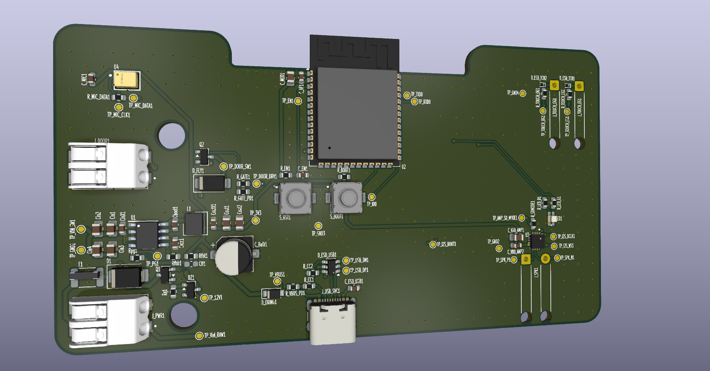
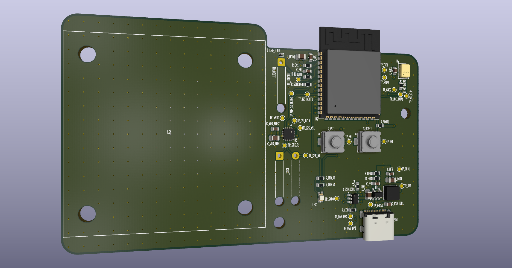

# ClearBell — Smart-Doorbell (ESP32-S3, Hardware + Firmware)

Selbst entwickeltes Türklingelsystem für ein Zweifamilienhaus — vollständig
eigenentwickelt von der Schaltung über das PCB-Layout bis zur Firmware.
Das Projekt dokumentiert nicht nur *was* gebaut wurde, sondern die
**begründeten Technikentscheidungen** dahinter.

> Leitsatz des Projekts: **„Keep it simple, but working."**

**Aktuelle Generation: V0.2** — Redesign auf den ESP32-S3. Beide Platinen sind fertig
verlegt, geprüft und zur Fertigung eingereicht. Die erste Generation läuft im Haus und
liegt im [Archiv](archiv/V0.1/).

| Außeneinheit V0.2 | Inneneinheit V0.2 |
|---|---|
|  |  |
| 110 × 60 mm, 4 Lagen, 12 V DC | 98 × 60 mm, 4 Lagen, USB-C |

---

## Überblick

Eine **Außeneinheit** an der Haustür und zwei baugleiche **Inneneinheiten**
(je eine pro Wohnung). Klingeln und Türöffnen laufen als quittierte,
gegen Replay abgesicherte Transaktionen über WLAN/UDP.

| Merkmal | V0.2 |
|---|---|
| Controller | ESP32-S3-WROOM-1-N16R8 (16 MB Flash, 8 MB PSRAM), beide Einheiten |
| Stromversorgung außen | 12 V DC (SELV) → 3,3 V mit LMR33630; Polyfuse, TVS-Diode, Verpolschutz |
| Stromversorgung innen | USB-C 5 V → 3,3 V mit TLV62568 |
| Programmierung | natives USB (USB-Serial-JTAG) — innen über die USB-C-Buchse, außen über eine zusätzliche Service-USB-C |
| Bedienung | kapazitive Touch-Taster mit Bronze-Elektroden, ESD-geschützt |
| Audio | MAX98357A I2S-Class-D, Visaton K 50 FL (außen) / K 50 SQ (innen) |
| Mikrofon | Infineon IM72D128V01 (PDM, IP57) auf beiden Einheiten |
| Anzeige | zweifarbige Status-LED (grün / rot, zusammen bernstein) |
| Türöffner | Low-Side-MOSFET mit Freilaufdiode |
| Kommunikation | WLAN + UDP über den Heim-Router, Türbefehl per HMAC-SHA256 authentifiziert |

---

## Was sich gegenüber V0.1 geändert hat — und warum

- **ESP32-S3 statt ESP32.** Natives USB: Flashen und Logs ohne UART-Adapter und ohne
  Tastendruck. PSRAM für Audiopuffer, Flash-Reserve für zwei OTA-Partitionen, vom
  Hersteller zugesagte Verfügbarkeit bis 2033.
- **Mikrofon auf beiden Einheiten** — als Vorbereitung für späteres Wechselsprechen.
  Die Wahl fiel auf ein PDM-Mikrofon, das direkt an 3,3 V läuft: kein zweiter
  Spannungsbereich, keine Pegelwandler.
- **Keine SD-Karte mehr.** Die Klingeltöne sollen im Flash liegen und über die
  Statusseite getauscht werden — ein Steckverbinder und ein mechanischer Fehlerpfad weniger.
- **4 Lagen statt 2.** Beide Innenlagen sind Masse; jede Signallage hat ihre Bezugsfläche
  direkt darunter. Grund: Bei 1,6 mm liegt der dicke Kern zwangsläufig zwischen den
  Innenlagen, eine eigene Versorgungslage brächte dort kaum Flächenkapazität.
- **Vias neben den Pads, nicht darin.** Ein Via im Pad zieht beim Reflow Lot ab. Der DRC
  prüft das nicht — deshalb eigene Prüfskripte über alle Vias und Pads.
- **Touch ohne Shield/Guard.** Die Bronze-Elektroden bleiben frei zugänglich. Gegen Drift
  durch Feuchte ist eine adaptive Baseline in der Firmware vorgesehen; die ESD-Dioden haben
  nur 0,5 pF, damit die Empfindlichkeit erhalten bleibt.
- **Türöffner-Freilaufdiode auf 1 A ausgelegt** (SMA-Gehäuse). In V0.1 saß dort eine
  Signaldiode, die für den Spulenstrom des Türöffners zu klein war.

Der Funk-Transport bleibt WLAN/UDP über den Router — ESP-NOW wurde an den echten
Montageorten gemessen und verworfen, siehe
[`docs/Funkvalidierung_ESPNOW.md`](docs/Funkvalidierung_ESPNOW.md).

---

## Repo-Struktur

```
clearbell/
├── hardware/                  V0.2, KiCad 10
│   ├── Ausseneinheit/         Schaltplan, Platine, Schaltplan.pdf
│   │   └── fertigung/         Gerber-ZIP, Stückliste, Bestückungsdaten
│   └── Inneneinheit/          dito
├── docs/
│   ├── img/                   3D-Ansichten V0.2
│   ├── Softwarearchitektur_V0.2.md      Firmware-Architektur, Laufzeit, Sicherheit
│   ├── Softwarearchitektur_V0.2.en.md   dasselbe auf Englisch
│   └── Funkvalidierung_ESPNOW.md
└── archiv/V0.1/               erste Generation: Hardware, Firmware, Dashboard, Dokumentation
```

---

## Fertigung

| | |
|---|---|
| Lagenaufbau | 4 Lagen, 1,6 mm, FR-4 (S1000H, TG150), 1 oz außen und innen, keine Impedanzkontrolle |
| Oberfläche | ENIG, Lötstopplack grün, Bestückungsdruck weiß (nur oben) |
| Bestückung | einseitig, maschinell — außen 56, innen 33 Bauteile |
| Stückliste | je Einheit in `fertigung/`, mit Spalte „Ersatz zulässig" (kritische Teile ohne Ersatz) |
| Prüfung | DRC und ERC ohne Befund |

Leiterplatten und Bestückung der V0.2 übernimmt **[www.pcbway.com](https://www.pcbway.com)** im Rahmen eines Sponsorings.

---

## Firmware

Die Firmware — Arduino Core, quittiertes UDP-Protokoll, HMAC-gesicherter Türbefehl,
eigener WAV-Player — läuft auf V0.1 und liegt unter
[`archiv/V0.1/firmware/`](archiv/V0.1/firmware/). Die V0.2-Firmware entsteht nach der
Inbetriebnahme der V0.2-Platinen: Die Prinzipien des Protokolls werden übernommen,
Paketformat, Türbefehl, Fern-Öffnen und Touch-Auswertung dagegen neu aufgesetzt.

**Wie die V0.2-Firmware aufgebaut wird, beschreibt ein eigenes Dokument:** Architektur und
Ausführungsmodell, authentifiziertes Protokoll, Startsequenz und Laufzeitverhalten,
Datenhaltung und Flash-Aufteilung, ein Sicherheitskapitel mit Angreifermodell,
**offen benannten Restrisiken** und einem Abgleich mit ETSI EN 303 645, Fehlerverhalten,
Portierungsplan und Teststrategie. Die aktuelle Revision 2 ist das Ergebnis eines
kritischen Reviews der ersten Fassung mit 29 Befunden.

📄 [**Softwarearchitektur V0.2**](docs/Softwarearchitektur_V0.2.md) · 🇬🇧 [English version](docs/Softwarearchitektur_V0.2.en.md)

Was dort bereits läuft und was noch Entwurf ist, ist durchgehend gekennzeichnet — ebenso die
fünf Verhaltensfragen, die bewusst noch offen sind.

---

## Stand

- **V0.2:** Schaltpläne und Layouts beider Einheiten fertig, Fertigungsdaten eingereicht.
  Als Nächstes: Inbetriebnahme (Versorgung → USB/Flash → Audio → Mikrofon → Touch → Türöffner),
  danach die Firmware-Portierung.
- **V0.1:** läuft im Haus; WLAN/UDP-Transport im Dauertest ohne Paketverlust.

---

## Hinweise

- **Datenblätter** der verwendeten Bauteile sind aus Urheberrechtsgründen **nicht** enthalten —
  sie sind über die Herstellerseiten frei verfügbar; die Typen stehen in den Stücklisten.
- Die eigene KiCad-Bibliothek ist in Schaltplan und Platine eingebettet. Die meisten
  **3D-Modelle** stammen aus der KiCad-Standardbibliothek und erscheinen in jeder
  KiCad-10-Installation; zehn Bauteile nutzen Herstellermodelle (Littelfuse, Panasonic,
  Infineon, TI, WAGO), die aus Lizenzgründen nicht enthalten sind — dort zeigt die
  3D-Ansicht nur die Pads.
- Netzwerknamen, Passwörter und kryptografische Schlüssel sind nicht im Repo.
- **Sicherheitslücken** bitte vertraulich melden, nicht als Issue — wie, steht in
  [`SECURITY.md`](SECURITY.md).

## Lizenz

[MIT](LICENSE) © 2026 André Körner
