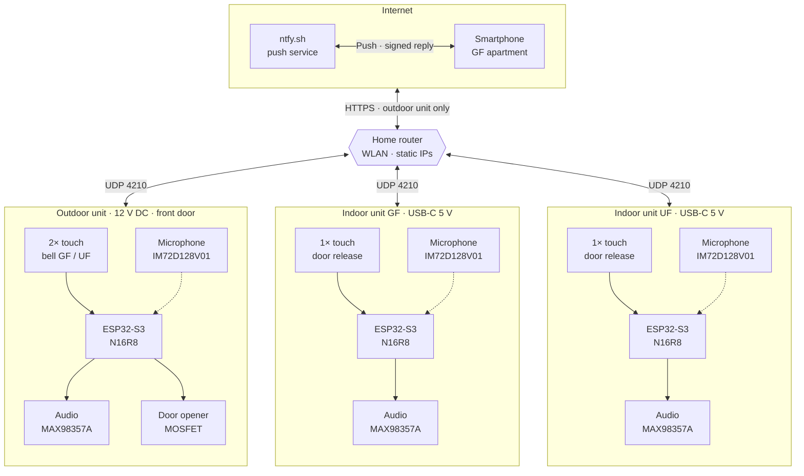
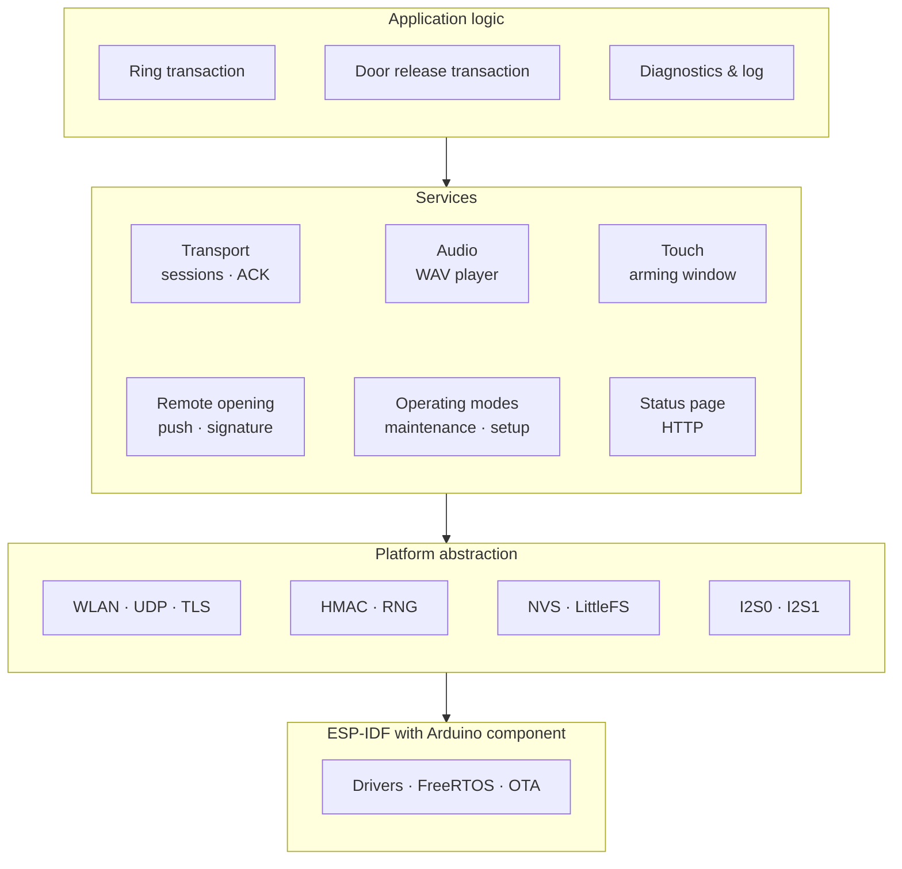
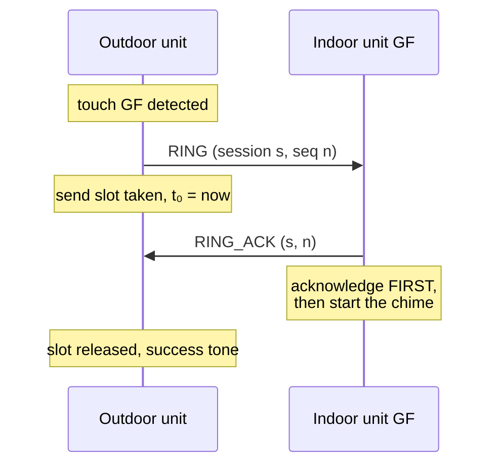
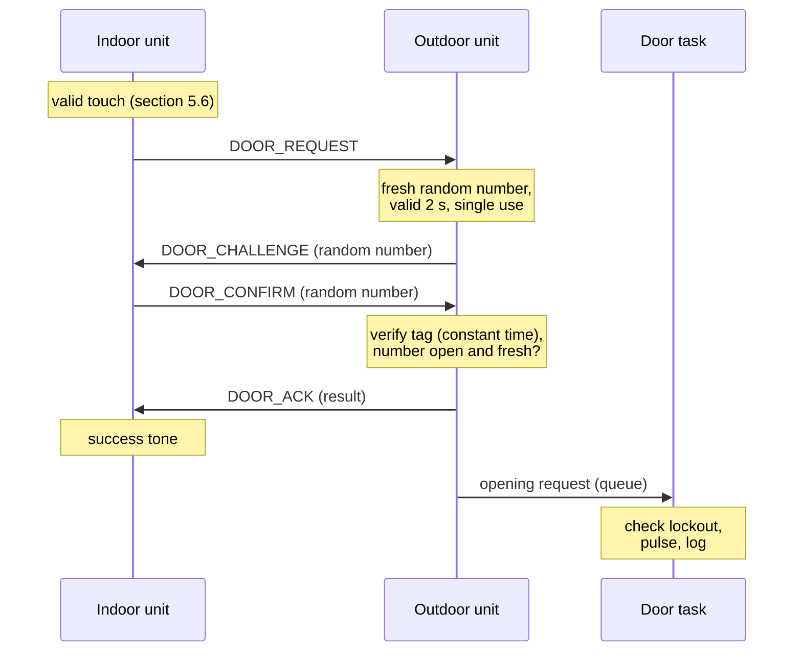
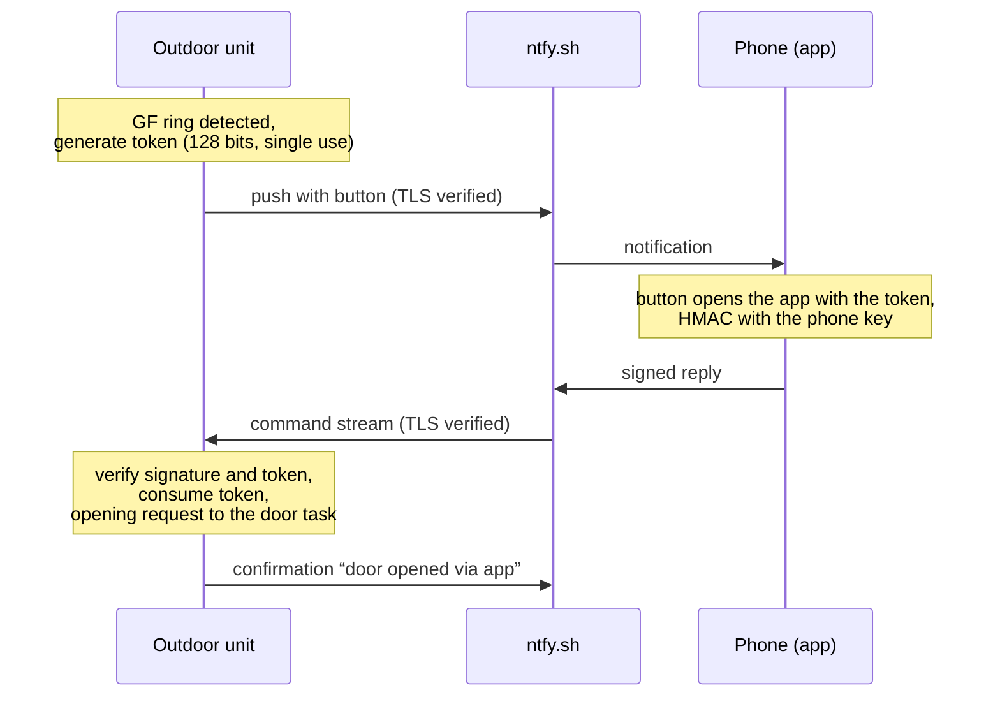
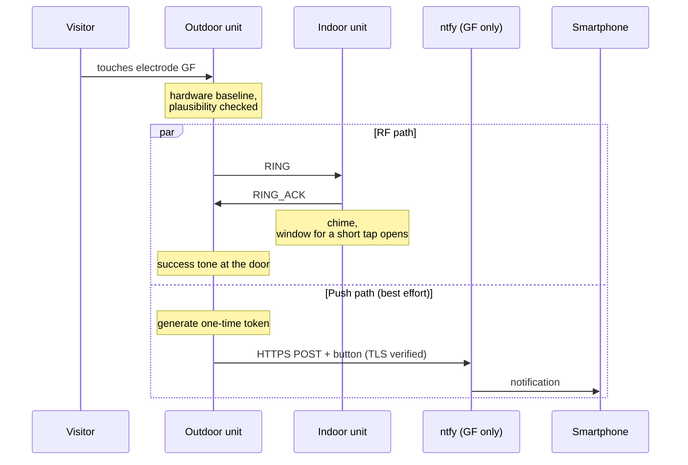
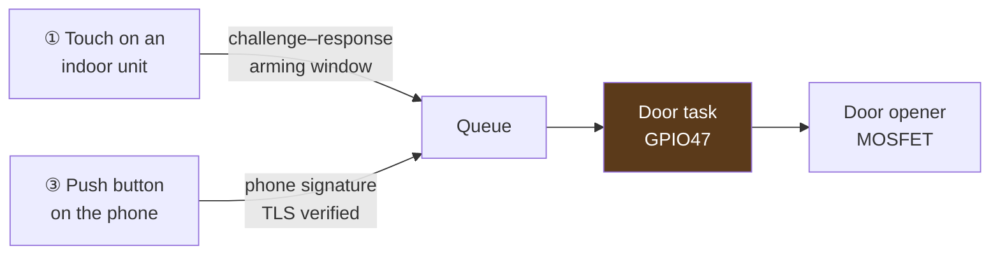
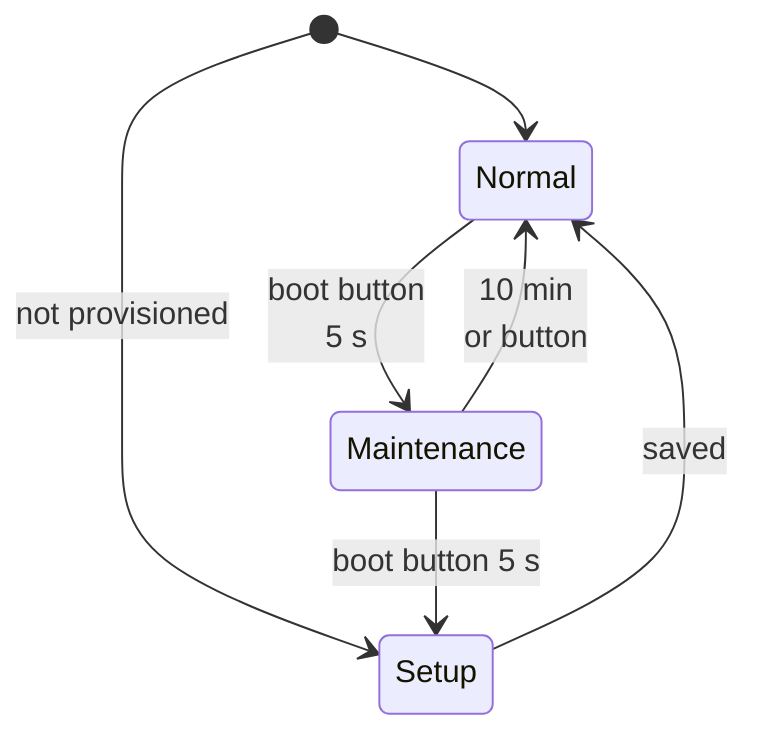
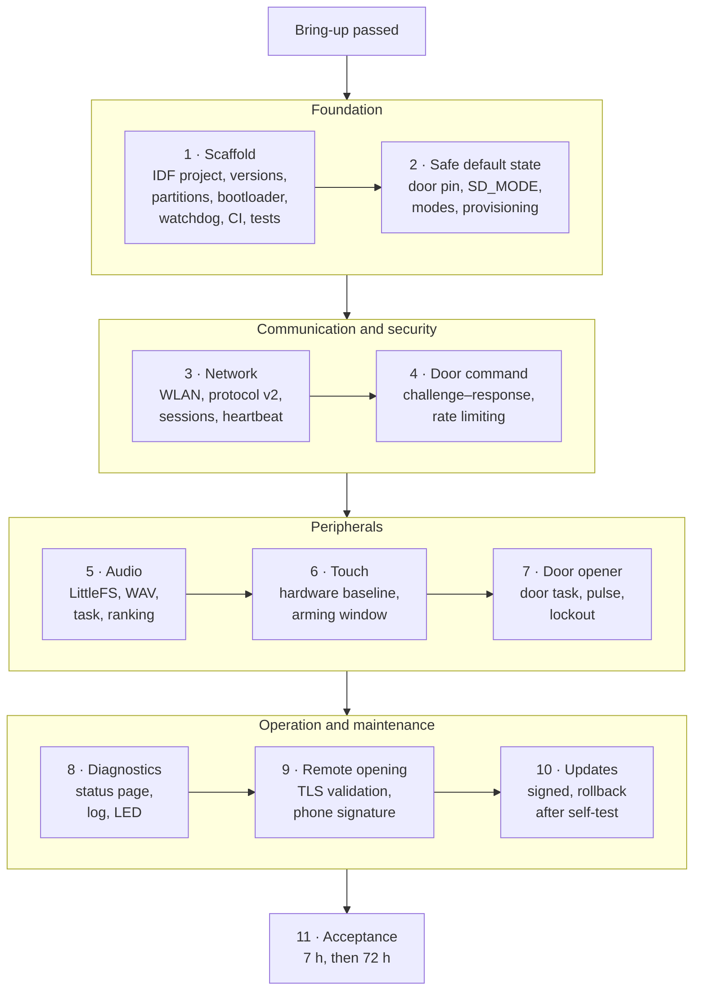

# ClearBell V0.2 — Software Architecture and Firmware Plan

> **Document type:** architecture and design document for the generation V0.2 firmware · **Revision 2**
> **As of:** 2026-09-26 · **Hardware:** in fabrication · **Firmware:** port not yet started
> **Deutsche Fassung:** [`Softwarearchitektur_V0.2.md`](Softwarearchitektur_V0.2.md)

---

## 0. What this document is — and what it is not

ClearBell is a custom doorbell system for a two-family house: one outdoor unit at the front door, two identical
indoor units, communicating over WLAN/UDP with no server of its own and no broker. The V0.2 hardware is fully
designed and in fabrication; the firmware for that hardware does not exist yet.

This document describes **the software that will run on those boards**: architecture, runtime behaviour, security
concept, data storage, test strategy, and the path from the V0.1 firmware currently in service.

**Revision 2** is the result of a review of the first version that was allowed to question everything except the
external constraints — one outdoor unit, two indoor units, the fabricated hardware, push notifications to a
smartphone. It found 29 issues, among them three paths to the front door against which the carefully built
cryptography did nothing. The seven decisions that followed are incorporated here and recorded in the project as
design decisions R17–R23. Section 16 shows what changed.

**Three things are kept strictly apart throughout:**

| Marker | Meaning |
|---|---|
| **[V0.1 — running]** | In continuous service in the house, measured or confirmed under test. The source is the actual code. |
| **[V0.2 — design]** | Specified target for the upcoming firmware. Not implemented, not measured. |
| **[open]** | Deliberately undecided. Collected in section 12. |

This is not a formality. An architecture document that makes planned work look like finished work is worthless —
and in this project the most expensive mistakes were all caught because assumptions were checked against reality
rather than the other way round. Statements about the platform in this document were checked against the Arduino-ESP32
core 3.3.10 actually installed, not against its documentation.

**Not contained here:** network names, passwords, cryptographic keys, push topics, MAC addresses. Those are
operational secrets of one specific installation, not part of the architecture.

---

## 1. System overview

### 1.1 Topology



*GF = ground floor apartment, UF = upper floor apartment.* The microphones are dashed because in V0.2 they are fitted
but have no function (section 5.7).

### 1.2 Roles and responsibilities

| | Outdoor unit (1×) | Indoor unit (2×, identical) |
|---|---|---|
| **Triggers** | bell GF, bell UF | door release request |
| **Executes** | door opener pulse, push dispatch | chime playback |
| **Verifies** | door commands from the indoor units (challenge–response) and remote openings from the phone (signature) | rings and acknowledgements from the outdoor unit |
| **Knows keys** | one link key each for GF and UF, plus the phone keys | only its own link key |
| **Logs** | remote openings individually, touch openings only as a total | the openings of its own apartment |
| **Supply** | 12 V DC (SELV) | USB-C 5 V |
| **Particularity** | extra service USB-C; carries the door opener driver | supply and programming share one socket |

**Two independent bell paths.** The GF button reaches only the GF unit, the UF button only the UF unit. No
broadcast, no group logic — every ring is a self-contained transaction to exactly one destination. The **door
opener, by contrast, is shared**: both apartments open the same front door.

This asymmetry shapes the security concept (section 7): a failed ring is an annoyance, a falsely triggered door
opener is a burglary. At the same time the two apartments are two **separate households** — what one unit logs is
none of the other's business (section 6.4).

### 1.3 Quality goals

| Goal | Metric | Target | Status |
|---|---|---|---|
| **The door opens only when authorised** | trigger paths without authentication | **0** | design — sections 5.4, 7 |
| **Nothing is lost silently** | messages acknowledged but not executed | **0** | design — section 4.3 |
| The ring gets through | touch outside → chime inside | ≤ 0.5 s | measure during bring-up |
| Failure is reported | touch → failure tone at the door when the apartment does not answer | ≤ 1.5 s | V0.1: ≈ 1.2 s |
| Door command | release indoors → door opener pulse | ≤ 1 s | measure during bring-up |
| Self-healing | WLAN back → operational, without restart | ≤ 30 s | measure during bring-up |
| Continuous operation | no restart, free heap stable | 7 h as the gate for the port, ≥ 72 h before installation | V0.1: 7 h passed |
| Updates | a faulty update | rolls itself back to the previous version | design — section 8.1 |
| Privacy | microphone in normal operation | off | design — section 5.7 |

The targets are commitments of this design, not measurements. They are measured during bring-up and either confirmed
there or adjusted with a stated reason.

---

## 2. Platform and constraints

### 2.1 Target platform

| | Value | Note |
|---|---|---|
| Module | ESP32-S3-WROOM-1-**N16R8** | 16 MB flash, 8 MB octal PSRAM |
| Build | **ESP-IDF project with Arduino-ESP32 as a component** | Arduino API in the code, configuration (`sdkconfig`) under our control |
| Versions | pinned as a pair; the Arduino core 3.3.10 used so far is built on ESP-IDF 5.5.4 | verify the pairing against the release notes during setup; the component requires `CONFIG_FREERTOS_HZ=1000` |
| Configuration | `sdkconfig.defaults` and `partitions.csv` in the repository | every build is reproducible |
| Audio | `ESP_I2S` + custom WAV player | deliberately **not** `ESP32-audioI2S` |
| File system | LittleFS in internal flash | the SD card is dropped relative to V0.1 |
| Programming | native **USB-Serial-JTAG** (GPIO19/20) | flashing, console and debugging over one socket |
| Updates | dual OTA, **signed**, rollback **after a self-test** | section 8.1 |

**Why ESP-IDF rather than the Arduino IDE.** In the precompiled Arduino core, secure boot, flash encryption, NVS
encryption, anti-rollback and signed updates are switched off and cannot be switched on; Espressif itself points to
“Arduino as component” for this. As an IDF project the entire security configuration becomes reachable without giving
up the Arduino code. **Reachable does not mean enabled** — whatever is irreversible follows the hardening stages in
section 7.7.

**Why not `ESP32-audioI2S`.** The library requires PSRAM and pulls in decoders the project does not need. The custom
player reads 16-bit PCM block by block and pushes it to I2S — that is the entire required feature set. Even with the
S3's PSRAM this remains the right choice.

### 2.2 Hard constraints that bind the software

These follow from datasheets and from the fabricated board:

| Constraint | Consequence for software |
|---|---|
| **GPIO35/36/37 are octal PSRAM** | must never be configured — otherwise hard-to-diagnose boot failures |
| **PDM receive only on I2S0, 16-bit only** | microphone must be on **I2S0**, amplifier on **I2S1** |
| **GPIO19/20 = USB** | cannot be repurposed |
| **GPIO0/3/45/46 = strapping** | only GPIO0 is used deliberately (boot button) — and only during operation: held at power-up, the chip starts in download mode |
| **GPIO39–42 (JTAG) carry no copper** | no external JTAG adapter; debugging with GDB/OpenOCD runs over the built-in USB-JTAG on GPIO19/20 |
| **Deep sleep impossible** | both units are UDP receivers — a sleeping unit does not open the door |
| **Door opener gate floats after reset** | firmware drives the pin LOW **before anything else** (section 5.1) |
| **The door opener driver sits in the outdoor unit** | physical access to the outdoor unit is access to the door — no firmware helps against that, the mounting does (section 7.5) |

### 2.3 V0.2 pin assignment

Both units deliberately share **one** set of pin constants. Where a function does not exist indoors, the pin simply
stays unused rather than shifting the assignment.

| Function | GPIO | Outdoor | Indoor | Direction |
|---|---|---|---|---|
| Touch bell GF / door release button | **4** | bell GF | door release | analog in |
| Touch bell UF | **5** | bell UF | — | analog in |
| *Reserve guard / shield* | 6 / 14 | keep free | keep free | — |
| I2S1 BCLK → amplifier | **15** | ✓ | ✓ | out |
| I2S1 WS/LRCLK → amplifier | **16** | ✓ | ✓ | out |
| I2S1 DOUT → amplifier | **17** | ✓ | ✓ | out |
| Amplifier `SD_MODE` (mute) | **7** | ✓ | ✓ | out |
| I2S0 PDM CLK → microphone | **38** | ✓ | ✓ | out |
| I2S0 PDM DATA ← microphone | **21** | ✓ | ✓ | in |
| **Door opener gate** | **47** | ✓ | *unused* | out |
| Status LED red | **48** | ✓ | ✓ | out |
| Status LED green | **18** | ✓ | ✓ | out |
| USB D− / D+ | 19 / 20 | service socket | supply + data | — |
| Boot / reset | 0 / EN | button | button | — |
| UART0 TXD0 / RXD0 | 43 / 44 | test points | test points | fallback path |

**Free as reserve:** GPIO1, 2, 8, 9, 10, 11, 12, 13 — locked in the schematic with no-connect flags. “Reserve”
explicitly means *decide again at V0.3*, not *available at any time*.

The pin constants in the code carry **exactly the net names from the schematic** — including where these contain
German abbreviations (EG/OG, the German names of the two apartments, i.e. GF/UF). This prevents transcription errors
between hardware and software. All V0.1 pin definitions are void; nothing is carried over.

---

## 3. Software architecture

### 3.1 Layers



The layering exists so the **application logic stays testable without hardware**: ring and door-release
transactions, protocol, WAV parser and state machines run as unit tests on a PC (section 11.3). In V0.1 it was
exactly this separation that made it possible to separate the protocol test from the production code.

### 3.2 Execution model

Four ground rules:

1. **The main loop never blocks.** [V0.1 — running, carried over] Anything that can take more than a few
   milliseconds — WLAN association, TLS, audio, uploads — runs as a state machine in the loop or in its own task.
2. **Every resource has exactly one owner.** Other contexts only put requests into its queue. Above all the door
   opener: neither the touch path nor remote opening ever touch GPIO47 themselves.
3. **Hand-over only via FreeRTOS queues.** A `volatile` flag is not synchronisation on a dual-core processor. V0.1
   shared the push buffers and the token table between loop and task that way — a second push could overwrite the
   first one while it was being sent.
4. **Everything is on the watchdog.** The idle tasks of both cores and every task of our own are monitored. Out of the
   box the Arduino core does not monitor the main loop — that is switched on explicitly.

| Context | Content | Owner of |
|---|---|---|
| **Main loop** | transport (UDP, sessions, retries, heartbeat), touch, operating modes, LED | send slots, touch state |
| **Task `door`** *(outdoor)* | accepts opening requests, checks the lockout, generates the pulse, logs | **GPIO47** |
| **Task `audio`** | reads the file system, feeds I2S1, switches the amplifier | I2S1, `SD_MODE` |
| **Task `remote`** *(outdoor)* | sends the ring push, keeps the command stream open, issues and verifies tokens | token table |
| **HTTP server** (IDF) | status page, in its own task | — |

The ESP-IDF HTTP server runs in its own task anyway — one more reason for the IDF build: the Arduino `WebServer` reads
every request, including uploads, inside the calling loop; a 400 KB chime would have blocked it for seconds.

> **Unverified:** whether `i2s.write()` blocks on a full DMA buffer and thereby sets the pace of the audio task
> itself has never been measured. That belongs in bring-up (section 11.1).

### 3.3 Module split [V0.2 — design]

V0.1 is a single 731-line `.ino` — right for bring-up, no longer viable for V0.2.

| Module | Responsibility |
|---|---|
| `config.h` | pins (schematic net names), timing constants, unit type — **no secrets** |
| `cb_provisioning` | reads role, keys and WLAN credentials from the factory partition; setup, factory reset |
| `cb_protocol` | v2 frame, serialisation, HMAC, sessions, challenge–response |
| `cb_transport` | UDP, send slots, retries, heartbeat, rate limiting |
| `cb_audio` | WAV parser, playback, priorities, volume, `SD_MODE` |
| `cb_touch` | hardware baseline, plausibility, arming window |
| `cb_door` *(outdoor)* | door task — **the only place that touches GPIO47** |
| `cb_remote` *(outdoor)* | push, tokens, command stream, phone signatures |
| `cb_status` | LED, status page, door-opening log, counters |
| `cb_modes` | normal operation, maintenance, setup |
| `cb_ota` | accept an update, verify its signature, self-test, rollback |

There is **one firmware image per unit type** (outdoor, indoor). GF and UF differ only in their provisioning — no image
contains a secret.

Isolating `cb_door` is intentional: if exactly one task drives the door opener pin, answering “what can open the
door?” is a text search rather than a code review.

---

## 4. Communication protocol

### 4.1 Transport decision

**WLAN + UDP directly between the units via the home router.** No MQTT broker, no Raspberry Pi, no cloud.

ESP-NOW was not rejected on taste but after a full RF validation at the actual mounting locations: the link was
functionally dead there, and every lever (channel choice, transmit power, antenna orientation) had been exhausted.
The measurements are in [`Funkvalidierung_ESPNOW.md`](Funkvalidierung_ESPNOW.md) (German). The WLAN/UDP stack
subsequently passed a seven-hour endurance test with no packet loss and no restart.

UDP offers no transport acknowledgement. **The only success criterion is therefore the application acknowledgement** —
not “sent”, but “the receiver confirmed that it processed this”.

### 4.2 Protocol v2 [V0.2 — design]

V0.1 used a 14-byte packet in which only the door command was authenticated. Version 2 authenticates **every**
message, detects restarts of the sender and allows later changes.

| Field | Bytes | Purpose |
|---|---|---|
| `magic` = `CB` | 2 | discard foreign packets without computation |
| `version` | 1 | later changes without breakage — the devices are updated one after another |
| `type` · `sender` · `receiver` | 3 | receiver in the packet: a packet meant for GF is not valid at UF |
| `session` | 4 | random number per start of the sender (section 4.3) |
| `seq` | 4 | running within the session |
| `payload` | 0…n | e.g. random challenge, result |
| `tag` | 16 | HMAC-SHA256 over `"CBv2"` ‖ all preceding fields, truncated to 128 bits |

**Rules:**

* **One key per link** — outdoor↔GF and outdoor↔UF each have their own. GF and UF share no key and cannot forge each
  other.
* **Fixed byte order** (little endian) and serialisation through dedicated functions, not through a `packed struct`.
* **Order of checks on receipt:** length and `magic` → rate limit per sender → version → tag (constant time) → session
  and `seq`. Whatever fails is discarded without an answer.
* **Versions:** every unit understands its own version and the previous one.
* **Why 128 bits:** NIST allows truncation down to 32 bits; the forgery probability is (1/2)^(λ − t) with 2^t allowed
  failed attempts. 64 bits would suffice with rate limiting — 128 bits take the question off the table for 8 bytes.

**Message types:**

| Type | Direction | Purpose | V0.1 |
|---|---|---|---|
| `PING` / `PONG` | both | heartbeat every 30 s; establishes sessions | defined, never sent |
| `RING` / `RING_ACK` | outdoor → indoor / back | ring | `KLINGEL` / `KLINGEL_QUITT` |
| `DOOR_REQUEST` | indoor → outdoor | request a door command | — |
| `DOOR_CHALLENGE` | outdoor → indoor | fresh random number | — |
| `DOOR_CONFIRM` | indoor → outdoor | returns the random number; the tag proves the key | `TUER_AUF` (with counter) |
| `DOOR_ACK` | outdoor → indoor | result | `TUER_QUITT` |

### 4.3 Acknowledgement, retry, sessions



| Parameter | Value | Rationale |
|---|---|---|
| Acknowledgement timeout | **300 ms** | shown in RF testing to sit safely above round-trip time [V0.1 — running] |
| Retries | **max. 3** | after that the transmission counts as definitively lost |
| Time to “failure” | **≈ 1.2 s** | initial send plus three retries of 300 ms |
| Concurrent transmissions | **3 slots** | GF and UF rings may overlap |

**The acknowledgement goes out before the payload action.** The indoor unit replies first and only then starts the
chime; the other way round, audio output would eat into the sender's acknowledgement window.

**Sessions and duplicates.** Every unit draws a new session number at every start. A duplicate is a message with
**the same session and the same number** as one already processed; it is not executed again, **but it is still
acknowledged** — the most common cause of a duplicate is a lost acknowledgement.

The session number exists because of a flaw in V0.1: there the ring counter started at 0 at every boot, and the indoor
unit recognised a duplicate only by an equal number. After a restart of the outdoor unit a ring could therefore be
**acknowledged but not played** — the visitor heard the success tone, nothing rang inside.

**New sessions** are confirmed by the heartbeat: after starting, every unit immediately reports to its peers. If a
message with an unknown session arrives nonetheless, the receiver answers with a challenge and the sender's retry
gets through — at worst 300 ms later. A recorded packet from an old session fails this challenge.

**Heartbeat:** every 30 s; after three missing answers the peer counts as unreachable (LED red). The outdoor unit thus
knows that an apartment is unreachable before the next ring.

### 4.4 Door command by challenge–response



| Property | Implementation |
|---|---|
| **Authenticity** | the tag on every message (section 4.2), a separate key per apartment |
| **Freshness** | random number from the hardware RNG — truly random while the radio is active —, valid 2 s, single use |
| **Replay** | impossible: a recorded confirmation matches no new random number |
| **No persistent state** | no counter in NVS — nothing can drift apart after reflashing |
| **Acknowledge before acting** | `DOOR_ACK` goes out, then the door task takes over |

**Why the V0.1 counter is gone.** V0.1 protected the door command with a strictly increasing counter in the NVS of both
sides. That has two weaknesses: if the outdoor unit loses its NVS, recorded commands become valid again; if an indoor
unit loses its NVS — for instance through a full reflash — its counter restarts at 1 and the outdoor unit discards
every one of its commands as a replay, practically forever. Challenge–response has neither problem.

**Cost:** one extra round trip on the LAN. With modem sleep each step may wait for the router's next DTIM beacon — the
time to the pulse is measured during bring-up (target ≤ 1 s, section 1.3).

### 4.5 Remote opening via push [V0.2 — design]

The use case is concrete: a child is locked out, no adult is home.



| Property | Implementation |
|---|---|
| **The phone signs** | HMAC-SHA256 over the token with a key that exists only on this phone and in the outdoor unit; the message carries an algorithm identifier |
| **One key per phone** | revocable individually, e.g. when a phone is lost |
| **Token** | 128 bits, single use, bound to exactly one ring; its validity is set during bring-up — 5 min is acceptable because the token is worthless without the phone key |
| **TLS** | certificate validation against the certificate bundle embedded in the core (Mozilla list); no pinning — the server certificates change every few weeks |
| **Topics** | may remain public; ntfy.sh is only a transport |
| **Traceable** | every remote opening is confirmed by push and logged (section 6.4) |

**Why this way.** In V0.1 the one-time token was carried in the push itself. On ntfy.sh a topic without a paid
reservation is public — “the topic is essentially a password” —, and messages are retained for 12 hours. Anyone
reading the alert topic held a valid opening token. Access control on ntfy.sh costs money or requires an own server
reachable from the internet. The phone signature solves the problem for free and takes the service operator out of
the chain of trust as well.

**Platforms.** Android: the app “HTTP Shortcuts” has a built-in HMAC function and accepts values through deep links —
the push button opens it with the token. iOS: the Shortcuts app, as far as available descriptions go, has no HMAC,
only plain hashes; how signing can work there is [open]. The algorithm identifier keeps the door open for a second
scheme without breaking Android.

---

## 5. Runtime behaviour — what happens when

### 5.1 Start-up sequence [V0.2 — design, safety critical]

Principle: **first bring everything into a safe state, then enable functions.**

| # | Step | Why here |
|---|---|---|
| 1 | **GPIO47 as output, LOW** *(outdoor)* | the pin floats after reset; until firmware defines it, only the 100 kΩ gate pull-down holds it. Very first statement. |
| 2 | **Amplifier muted** (`SD_MODE` LOW) | no switch-on pop; the pull-down already keeps it muted during boot |
| 3 | Status LED off | “dark” means *firmware not running yet* |
| 4 | Logging over USB-CDC | diagnostics available from here on |
| 5 | Read reset reason and boot counter | an unexpected restart of the outdoor unit is reported later by push (section 7.5) |
| 6 | Check the factory partition | not provisioned → setup (section 5.9); otherwise load role and keys |
| 7 | NVS settings, check the schema version | migrate data after an update if needed |
| 8 | Mount LittleFS | if that fails, the device continues silently |
| 9 | Configure I2S1 (amplifier) | no output yet |
| 10 | **Do not start the microphone** | no clock, no data — section 5.7 |
| 11 | Initialise touch, learn the baseline | needs a brief quiet period with no contact |
| 12 | Start WLAN — event-driven, non-blocking | the device must become operational even without a network |
| 13 | Start tasks, register all with the watchdog | `door`, `audio`, `remote`, HTTP server |
| 14 | Update self-test if a new image is running | confirmed only once WLAN and the peer respond (section 8.1) |
| 15 | Set the LED to the first real state | from here the display tells the truth |

Step 1 is the core of the requirement “the door opener must never trigger through boot, reset or brownout”: in
hardware through the pull-down, in software through this ordering — **both together**.

### 5.2 Main loop

One iteration, fixed order, no step blocks:

| Step | Purpose |
|---|---|
| Transport | accept one UDP packet (rate limited), sessions, due retries, heartbeat |
| Touch | evaluate hardware values, plausibility, arming window, put requests into queues |
| Operating modes | boot button, maintenance time window |
| LED | update the status colour |
| Watchdog | sign of life |

Audio, push, command stream, door opener and status page run in their tasks (section 3.2).

### 5.3 Ring sequence — complete



**The push path never blocks the RF path.** It runs in its own task and is explicitly best-effort: with no internet
it is skipped, and the visitor never notices. What happens when someone taps the button in the notification is
shown in section 4.5: the phone signs, the outdoor unit verifies and opens.

| Event | When |
|---|---|
| Touch detected | after repeatedly confirmed samples, on the order of 100 ms (V0.1 value, to be re-measured on the S3) |
| Acknowledgement back | typically a few ms, with modem sleep up to the next DTIM beacon |
| Success tone at the door | effectively immediately after the acknowledgement |
| **Failure tone** (apartment empty / no WLAN) | **only after ≈ 1.2 s** — before that, failure is not established |
| No WLAN at all | immediate failure path, no send attempt |

The late failure tone is not a defect but a consequence of “the acknowledgement is the only success criterion”.

### 5.4 Door opener — two trigger paths



| Path | Who | Protection |
|---|---|---|
| **①** touch on an indoor unit | residents at home | challenge–response (section 4.4), touch plausibility and arming window (section 5.6) |
| **②** ~~status page, HTTP POST~~ | — | **removed:** it had no authentication — “POST only, local network only” protects neither against a foreign device on the WLAN nor against cross-site request forgery. The status page does not open the door, not even with a password. |
| **③** push button on the phone | residents away | phone signature, TLS validation, one-time token (section 4.5) |

The numbers are kept so references stay unambiguous; ② is not reused.

**The door task** is the only owner of GPIO47 (section 3.2):

* It takes requests from its queue — whichever path they come from.
* It sets the gate and ends the pulse via a **hardware timer**, i.e. even if the loop hangs; plus a hard upper limit on
  the on-time.
* After every opening a **lockout applies to all paths**.
* Every opening is logged (section 6.4); a remote opening is additionally confirmed by push.

The pulse duration is [open] (section 12). The door-opener dry run during bring-up uses a serial command over USB, i.e.
only with physical access to the device — never over the network.

### 5.5 Audio

**Flow:** open file → parse RIFF/WAVE (find `fmt ` and `data` chunks, skip unknown ones) → compare the sample rate with
the current I2S configuration and reconfigure only on mismatch → enable the amplifier → playback in the audio task.

| Property | V0.1 | V0.2 |
|---|---|---|
| Source | SD card (FAT32, SPI) | **LittleFS** in internal flash |
| Format | WAV, 16-bit PCM | unchanged |
| Block size | read 512 bytes, for mono pass 1 KB of stereo to I2S | unchanged, in the audio task |
| Volume | digital scaling 0–100 % before I2S | unchanged |
| Steps | 15 / 30 / 50 / 75 / 100 %, via the boot button, stored in NVS | unchanged (short press) |
| Amplifier | permanently enabled | **`SD_MODE` enables it on demand** |
| Precedence | the newest sound replaces the current one | **ranking:** ring > failure > success > UI feedback |

The digital attenuation deliberately sits **before** I2S: the MAX98357A has no volume control; its `GAIN` pin only sets
the clipping point (12 dB against GND here). After enabling via `SD_MODE` the amplifier needs a moment before the sound
starts cleanly — the audio task therefore begins with silence; the required lead time is determined during bring-up.

If a file is missing or is not 16-bit WAV, the device continues silently and logs it. **Audio is never a reason to
crash** — the doorbell must still be able to open the door without sound.

### 5.6 Touch

The bronze electrodes are **openly accessible**, not behind wood. That yields a large signal swing but exposes the
electrode directly to condensation and grime; a canopy stops driving rain, not dew. A shield channel and a guard ring
were deliberately rejected (both would require additional electrodes).

**The hardware provides the foundation.** On the S3 the core's touch driver uses the new IDF driver with a **hardware
baseline** (“benchmark”), a hardware filter and thresholds relative to the baseline (default 1.5 %); on top of that come
the internal denoise channel as well as hysteresis and debouncing. The firmware builds on this instead of implementing
its own baseline:

| # | Measure | Effect |
|---|---|---|
| 1 | **Evaluation relative to the hardware baseline** | fixed thresholds do not survive a change of season |
| 2 | **No tracking while a key is held** | the baseline does not creep onto a resting finger |
| 3 | **Outdoor plausibility:** if *both* bell buttons trigger simultaneously → discard | that is not a finger, that is wetness |
| 4 | **Minimum hold time** | debounces and filters transients |
| 5 | **Raw value and baseline on the status page** | drift becomes visible *before* it causes misbehaviour |

**Indoors the situation is harder:** outdoors a false trigger means a spurious ring, indoors it means an **open front
door** — and measure 3 does not apply there, because there is only one touch channel.

| | Indoor measure |
|---|---|
| a | **Maximum hold time for the short tap:** anything present for more than ~2 s is a cloth, a towel or someone leaning on it → discard and relearn the baseline |
| b | **Trigger only on release** — a permanently wetted sensor never triggers |
| c | **Longer minimum hold time than outdoors** |
| d | **Lockout after every door command** — for all paths (section 5.4) |
| e | **After a restart, fix the baseline only after a brief quiet period** |
| f | **Arming window:** for up to **2 min** after a ring **at this apartment**, a short tap opens the door. Otherwise it takes **holding for 3 s**; a confirmation tone signals when to let go. Whoever does not let go within a few seconds after the tone is discarded. |

In the normal case — the bell rings, someone presses — (f) costs no convenience. A cleaning cloth, a child or an
accidental touch outside the window triggers nothing.

The V0.1 thresholds (on 600 / off 800, 2× confirmed, 50 ms) are **not transferable** — the S3's value range is
different. To be clarified during bring-up: whether the denoise channel is active, how the hardware baseline is tracked
while a touch is resting, the upper limit for the long press, and whether the window closes after the first opening.

### 5.7 Microphone

The hardware is fitted on all three units: Infineon IM72D128V01, PDM, runs directly off 3.3 V, IP57, top port.

**In V0.2 the microphone has no function — and it does not run.** In normal operation the firmware does not start I2S0:
no clock, no data in buffers. That is privacy by default and saves power. During bring-up the path is checked with a
test command.

The later target state is **half-duplex intercom**: talk or listen, never both — the operating mode of every ordinary
door intercom, without echo cancellation.

> **A correction recorded in the project:** the earlier claim “full duplex is impossible by construction” has been
> withdrawn — it was unsubstantiated. Both I2S controllers sit on the same die and can possibly be fed from the same
> clock source. That is **unverified** and belongs in the V0.3 backlog.

When the microphone may be active at all is [open] — section 12.

### 5.8 Network behaviour

| Situation | Behaviour |
|---|---|
| No WLAN at start-up | the device boots fully, association proceeds in the background |
| WLAN lost | reconnect **event-driven**, with growing intervals up to at most 60 s — an association in progress is **never** aborted |
| WLAN returns | re-establish sessions via heartbeat, increment the drop counter |
| Send attempt without WLAN | treated as failure **immediately** — no waiting for a timeout |
| Foreign packet on the UDP port | discarded without being read |
| Packet flood | rate limit per sender before the HMAC check, counted on the status page |
| Command stream to the push service drops | reconnect with growing intervals and a random component — never every second |
| Peer unreachable at its static IP | fall back to the unit's mDNS name |
| **Modem sleep** | enabled; its effect on the 300 ms acknowledgement window is **measured**, not assumed |

**Why reconnection is rebuilt:** V0.1 called `disconnect()` and `begin()` every 3 s while not connected — even while an
association was still in progress. With a weak signal, where WPA2 and DHCP take longer, it aborted every attempt itself.

**Recommendations for the network**, outside the firmware: a dedicated network segment for just the three units, where
they can reach one another, separated from the rest of the home network — a guest network usually also isolates the
devices from each other and thereby breaks the UDP traffic. In addition WPA3 or protected management frames (PMF),
which prevent deauthentication attacks: the chip supports both, but PMF defaults to “optional” — the firmware sets
“required” when the router supports it.

### 5.9 Operating modes [V0.2 — design]



| Mode | How it is reached | What is possible |
|---|---|---|
| **Normal** | default | ringing, door command ①, remote opening ③; status page read-only, with device password |
| **Maintenance** | hold the boot button for 5 s during operation; ends after 10 min or via the button | sound upload, update, settings, diagnostics |
| **Setup** | from maintenance, or automatically as long as the device is not provisioned | set up role, keys and WLAN credentials; add or revoke phone keys; factory reset |

The boot button sits inside the housing. **Physical presence is therefore the second factor** for everything that
changes the firmware or its secrets — without user accounts, without password management. A short press steps the
volume, as in V0.1.

Initial provisioning runs over USB. If a unit later cannot join the WLAN — for instance after a router replacement —, in
maintenance it opens its own access point for setup; so nobody has to open the outdoor housing to reflash it. Press
durations and time windows are design values.

---

## 6. Data storage

### 6.1 Flash layout [V0.2 — design]

The basis is the Arduino core's standard scheme `default_16MB` (2 × 6.25 MB app, 3.4 MB file system, 64 KB core dump),
extended by a partition for the factory state.

| Area | Size | Purpose |
|---|---|---|
| 2× OTA app | ≈ 6 MB each | two full firmware slots |
| LittleFS | ≈ 3.4 MB | chime, success and failure tones (one chime ≈ 424 KB) |
| `nvs` | 20 KB | settings, calibration, door-opening log, schema version |
| `fctry` | small | **factory state:** role, link and phone keys, WLAN credentials, device password — read-only in normal operation |
| `coredump` | 64 KB | crash dump for diagnostics |
| `otadata`, `phy` | small | update management, RF calibration |

The table lives in the repository as `partitions.csv` and is **final before the first deployment** — it cannot be
changed by an update.

An update writes only the currently passive app slot; the file system and the NVS partitions are untouched. The real
risk of an update is therefore not data loss but **a changed data format** — for that the NVS carries a schema version,
and new firmware migrates on first start.

The headroom is this generous because speech recognition does **not** run on the device; its models alone would have
taken about 6 MB.

### 6.2 NVS

| Partition | Content | Written |
|---|---|---|
| `nvs` | volume, touch calibration, door-opening log, schema version | during operation |
| `fctry` | role, keys, WLAN credentials, device password | only in setup; erased only by a factory reset |

The separation ensures that resetting the settings does not take the keys with it — and conversely that a factory
reset really erases everything secret. The door-command counters of V0.1 disappear entirely with challenge–response.

### 6.3 Changing chimes without a PC

The SD card is gone. Chimes are uploaded into LittleFS through the status page — **only in maintenance**: the file is
written to a temporary file, checked as 16-bit WAV and only then renamed into place atomically; an aborted upload leaves
no half chime. That was the condition for dropping the card: *“the SD can go if the chimes can be swapped without a PC.”*

### 6.4 Door-opening log [V0.2 — design]

The log makes misuse visible — for instance a remote opening nobody triggered. But it inevitably contains data from
**both** households. Therefore:

| Where | What is logged and shown |
|---|---|
| **Indoor unit GF / UF** | only the door openings of its **own** apartment, with time and result |
| **Outdoor unit** | remote openings **individually** (they exist only for GF anyway); touch openings **only as a total**, without time and without apartment |

The log is a ring buffer in NVS. The time comes from NTP while internet is available; otherwise entries are relative to
uptime and marked as such.

---

## 7. Security concept

### 7.1 Assets, by weight

| # | Asset | Damage if lost |
|---|---|---|
| **1** | **The front door** | unauthorised entry — the single most severe failure of the system |
| 2 | Availability of ringing | a visitor goes unnoticed |
| 3 | Integrity of the firmware and the update path | whoever replaces the firmware owns the door |
| 4 | Confidentiality of room audio | microphones in living spaces and at the front door |
| 5 | Privacy between the households | what one apartment does is none of the other's business |
| 6 | Integrity of the display | a resident believes the door was opened when it was not |

### 7.2 Attacker model

| | Attacker | Capabilities | Response of the design |
|---|---|---|---|
| **A** | a device on the same WLAN (guest, compromised IoT device) | send arbitrary packets, eavesdrop | every message authenticated, challenge–response, no door via the web — and ideally a dedicated network segment |
| **B** | an attacker within RF range without WLAN access | jam, deauthenticate, test recorded handshakes offline against the WLAN password | PMF against deauthentication, WPA3 where possible, a strong WLAN password |
| **C** | an attacker on the internet path to the push service — or the service itself | redirect, eavesdrop | TLS with certificate validation; the phone signature makes an intercepted token worthless |
| **D** | physical access to the outdoor unit | open the housing | **opens the door directly** — the driver sits there; the mounting helps against that. Without secure boot the attacker could also install firmware with a backdoor → hardening stage C |
| **E** | an unauthorised person inside at an indoor unit | press the touch pad | arming window — outside it, a 3 s hold is required; anyone inside can unlock anyway |
| **F** | the other household | open the status pages | logs separated per household, a device password per unit |
| **G** | anyone who could install an update | load their own firmware | only in maintenance, only signed |

### 7.3 Measures

| Measure | Against | Stage (7.7) |
|---|---|---|
| **Every message authenticated**, 128-bit tag, one key per link | A, B | A |
| **Challenge–response** for the door command | A, B — record and replay | A |
| **Session numbers**, rate limiting | A — forgery, flooding; silent losses | A |
| **No door via the web** — path ② removed | A — a single HTTP request | A |
| **Phone signature** for remote opening, single-use token | C — intercepted tokens, service operator | A |
| **TLS with certificate validation** | C | A |
| **Arming window**, trigger on release, plausibility | E, false triggers | A |
| **Door task** as the only owner, pulse via hardware timer, lockout | concurrency, a hanging loop | A |
| **Door pin driven LOW first**, 100 kΩ gate pull-down | boot, reset, brownout, crash | hardware + A |
| **Maintenance via the boot button** for upload, update, setup | A, G | A |
| **Signed updates**, rollback after a self-test | G | A |
| **Provisioning instead of compiled-in secrets** | publication of images, D | A |
| **Keys in eFuse** (usable, not readable), encrypted NVS | D — read-out over USB | B |
| **Secure boot** of the outdoor unit | D — backdoor via reflashing | C |
| **Door-opening log**, confirmation push, restart report | traceability, tamper indication | A |
| **Microphone off**, no recording | asset 4 | A |
| **No secrets in the repository** | publication | done |

### 7.4 What revision 1 left open — and how it is solved

Revision 1 named eight weaknesses, some of them in the running V0.1 code. The review found two more paths to the door.
Status after revision 2:

| | Weakness | Solution |
|---|---|---|
| S-1 | TLS without certificate validation on the push path | certificate bundle of the core (4.5) |
| S-2 | push topic as a password on a public service | irrelevant for the door: the phone signs (4.5) |
| S-3 | losing NVS resets the replay protection | no counter any more: challenge–response (4.4) |
| S-4 | only the door command authenticated | every message authenticated (4.2) |
| S-5 | keys unencrypted in flash | provisioning, stage B (eFuse), stage C (7.7) |
| S-6 | no rate limit | rate limit per sender (4.2) |
| S-7 | 64-bit tag | 128 bits (4.2) |
| S-8 | WLAN credentials in plain text | provisioning, stage B (encrypted NVS) |
| new | **the status page opened the door without authentication** | path ② removed (5.4) |
| new | **the token was carried in the push itself** | phone signature (4.5) |

### 7.5 Remaining risks — deliberately accepted

* **The door opener driver sits in the outdoor unit.** Whoever opens the housing opens the door — no firmware changes
  that. In door-intercom practice it is therefore common to put the switching stage inside the secured area. For V0.2
  the hardware is fixed; what works is the **mounting**: a housing that cannot be opened from outside, and supply lines
  that cannot be reached from outside. Moving the driver inside is earmarked for V0.3.
* **Tamper indication only on power interruption.** The outdoor unit reports every restart with its cause by push; the
  indoor units report its outage through the heartbeat. Opening it without interrupting power goes unnoticed — the
  board has no housing switch.
* **Until hardening stage C**, someone with access to the housing can install their own firmware.
* **The push service is best-effort.** If ntfy.sh fails there is no push and no remote opening; ringing and the indoor
  door command do not depend on it.
* **A lost phone** is protected by its screen lock until its key is revoked.
* **Router and WLAN** remain a precondition for ringing; without them the door gives a distinguishable notice tone
  (section 12, F-4).

### 7.6 Keys and secrets

| Secret | Where | Stage B / C |
|---|---|---|
| Link keys outdoor↔GF, outdoor↔UF | factory partition | eFuse (HMAC peripheral: usable, not readable) |
| Phone keys | factory partition of the outdoor unit, and on the phone | encrypted NVS |
| WLAN credentials, device password | factory partition | encrypted NVS |
| Update signing key | **private key offline with a copy**, public key in the firmware | stage C: secure boot key plus a spare key |

Losing the signing key would be the only way to lock oneself out **for good** — hence the copy and the spare key.

**eFuse budget:** the S3 has exactly **6 key blocks**, shared by flash encryption, secure boot digests and HMAC keys.
With the outdoor unit fully hardened — 2 link keys, 1 NVS key, 1 flash encryption key, 2 secure boot keys — all 6 are
used. The allocation is fixed before the first block is burned; a wrongly assigned block is lost.

### 7.7 Hardening in stages

| Stage | Content | Reversible? | When |
|---|---|---|---|
| **A** | everything in 7.3 without eFuse | yes | with the port |
| **B** | keys in eFuse, NVS encryption, anti-rollback | burning eFuses is final, **but does not lock the device** | after acceptance of the port |
| **C** | outdoor unit only: secure boot with a spare key, secure download mode; flash encryption only if still justified then | **no** | at the earliest after some months of stable operation, and only once the mounting protects the housing |

The indoor units get no stage C — they hang inside the apartments. For the outdoor unit secure boot without flash
encryption will probably suffice: the firmware is open source and need not be secret, and after stage B the secrets
live in eFuse or in encrypted NVS.

### 7.8 Privacy

Microphones in a home and at a front door are not legally neutral. In Germany, recording the spoken word engages § 201
of the Criminal Code (StGB), and the GDPR applies on top — all the more once audio leaves the device. The decisions:

* **No recording, no storage** as default behaviour; a visitor journal is not planned.
* **The microphone does not run in normal operation** (section 5.7).
* **No dedicated activity indicator in hardware** — decided reversibly: the status LED could add one in firmware.
* **The logs are separated per household** (section 6.4).
* When the microphone may be active at all is [open] — section 12.

*I am not a lawyer; this section is not legal advice.*

### 7.9 Alignment with ETSI EN 303 645

EN 303 645 (V3.1.3, 2024-09) is the European baseline standard for consumer IoT cyber security. For a private build it
is not mandatory, but as a yardstick it is exactly right.

| No. | Provision | Implementation in the design |
|---|---|---|
| 5.1 | No universal default passwords | keys and device password per unit, generated at provisioning |
| 5.2 | Implement a means to manage reports of vulnerabilities | [`SECURITY.md`](../SECURITY.md): reporting channel, timelines for acknowledgement and status updates |
| 5.3 | Keep software updated | signed updates, rollback after a self-test |
| 5.4 | Securely store sensitive security parameters | provisioning, stage B |
| 5.5 | Communicate securely | every message authenticated, TLS validated |
| 5.6 | Minimize exposed attack surfaces | no door via the web, write actions only in maintenance |
| 5.7 | Ensure software integrity | signed updates, stage C |
| 5.8 | Ensure that personal data is secure | microphone off, logs per household |
| 5.9 | Make systems resilient to outages | sessions, challenge–response, watchdog, reconnection |
| 5.10 | Examine system telemetry data | door-opening log, restart report, counters |
| 5.11 | Make it easy for users to delete user data | factory reset |
| 5.12 | Make installation and maintenance of devices easy | maintenance and setup via the boot button |
| 5.13 | Validate input data | order of checks in the protocol, upload validation, fuzzing |

**Binding** only once a product is placed on the market. The cyber security requirements of the Radio Equipment
Directive apply since 1 August 2025; the EN 18031 series has been harmonised for them since January 2025, with
restrictions — for example no presumption of conformity for EN 18031-2 if the user may skip setting a password. The
device password therefore cannot be disabled. The Cyber Resilience Act applies in full from 11 December 2027.

---

## 8. Failure behaviour and diagnostics

### 8.1 Guiding principle

**Every fault becomes a defined operating state, never a crash.** The order of resilience is: open the door > deliver
the ring > play the sound > send the push > serve the status page. When something fails, it fails from the back.

| Fault | Behaviour |
|---|---|
| No WLAN | device runs, send attempts fail immediately with a failure tone, LED red |
| Peer unreachable | LED red after three missed heartbeats; a ring ends after ≈ 1.2 s with a failure tone |
| Sound file missing or corrupt | continues silently, log entry |
| File system cannot be mounted | continues silently, all other functions remain |
| No internet | no push, no remote opening; everything else untouched |
| All send slots occupied | immediate failure tone instead of silent discard |
| Firmware hangs | watchdog → restart; the door opener pulse ends via the hardware timer anyway |
| Crash | core dump to flash, restart, cause on the status page |
| Faulty update | rollback to the previous slot |

**Rollback needs a real self-test.** Out of the box the Arduino core confirms a new update immediately at start-up:
`verifyOta()` returns `true` before `setup()` even runs. An update that boots but no longer joins the WLAN would thus
be kept for good — and could not receive another update. ClearBell therefore overrides `verifyRollbackLater()` and
confirms an update only once WLAN, the peer and the update path work; otherwise it returns to the previous version.

### 8.2 Status LED

Two colours (red 630 nm / green 570 nm in one package), both channels active HIGH and PWM capable.

| Display | Meaning |
|---|---|
| **green** | **Ready** — device running, WLAN up, peer answers the heartbeat |
| **red** | **Fault** — no WLAN, or peer unreachable |
| **amber** (red + green) | **Ring acknowledged** — the press got through |
| off | no supply, or firmware not running yet |

* **During boot the LED is necessarily dark.** Neither pin is a strapping pin; both float after reset. **Every
  indication is a deliberate statement by the firmware.**
* **Amber is created optically, not electrically.** The two dies sit 1.2 mm apart; whether they blend into one colour is
  decided by the diffuser in the wooden front panel — to be judged during bring-up with the light guide fitted.
* Green appears brighter than the current suggests (1.87 mA green against 2.07 mA red), because 570 nm sits closer to
  the eye's peak sensitivity; the correction belongs in firmware via PWM.

**Blink patterns, night dimming, the maintenance indication and the colour semantics of the indoor unit are [open]**
and can be decided during bring-up without any hardware change.

### 8.3 Status page [V0.2 — design]

A small HTTP page per unit on the local network, in the IDF HTTP server's own task — **read-only, with a device
password**:

| Area | Content |
|---|---|
| RF | RSSI, channel, BSSID, connection drops |
| Protocol | sent / acknowledged / retried / lost, discarded and rate-limited packets, sessions |
| **Touch** | **raw value and hardware baseline per channel** |
| Door openings | the log according to section 6.4 — on each unit only what it may show |
| Audio | volume, last file, file listing |
| System | firmware version, uptime, restart cause, minimum free heap, active OTA slot |

**Write actions** — upload a sound, update, settings — exist **only in maintenance**. **There is no “open door”
action.**

The touch row is the real reason for the page: it makes drift measurable *before* it causes misbehaviour, and it
provides the basis for the one retrofit option the hardware keeps open (shield/guard on the reserved GPIO6/14).

### 8.4 Logging and debugging

USB-CDC over the service socket that exists anyway; the built-in USB-JTAG for debugging with GDB/OpenOCD runs over the
same socket. After a crash a core dump is in flash. As a fallback, TXD0/RXD0 are routed to test points; together with
EN, IO0, 3V3 and GND that forms a complete flashing path without USB.

---

## 9. Conventions

| Rule | Reason |
|---|---|
| **Identifiers and comments in English** | consistent with the English APIs; readable for anyone who reads the code. The reasoning is documented in detail in the documents. |
| **Pin constants = schematic net names** | prevents transcription errors between hardware and software; “EG”/“OG” are the German names of the apartments there and are commented in the code |
| **Project prefix `CB_` for constants** | identifiers such as `STATUS`, `OK` or `ERROR` collide with ESP32 ROM headers — a real and hard-to-find error |
| **Configuration lives in the repository** | `sdkconfig.defaults`, `partitions.csv`, pinned versions — every build is reproducible |
| **Secrets never in the repository and never in an image** | they reach the device by provisioning |
| **Explicit serialisation** instead of `packed struct` | fixed byte order, testable in unit tests |
| **No dynamic strings in long-running paths** | no creeping heap fragmentation |
| **Warnings as errors**, static analysis | errors early rather than in the field |
| **MAC via `esp_read_mac(..., ESP_MAC_WIFI_STA)`** | `WiFi.macAddress()` returns zeros before WLAN start-up |
| **I2S sine with a 2π-wrapped phase accumulator** | a growing index loses float precision → audible distortion |
| **Exactly one unit type per image**, checked at compile time | prevents mis-flashed devices |
| **Versions per SemVer**, Git tags, changelog | every device shows what it runs |

---

## 10. Porting plan V0.1 → V0.2

### 10.1 What carries over — and what does not

| Building block | Disposition |
|---|---|
| Protocol principles — application acknowledgement, acknowledge before acting, 300 ms / 3 retries | **carried over** — validated, confirmed in endurance testing |
| Packet format and duplicate detection | **replaced** by protocol v2 with sessions |
| Door command with NVS counter | **replaced** by challenge–response |
| WAV parser and volume logic | carried over, plus upload validation and sound ranking |
| WLAN upkeep | **new** — event-driven, with growing intervals |
| Push and remote opening | **new** — TLS validation, phone signature |
| Touch evaluation | **new** — hardware baseline, M-34, arming window |
| Web triggering of the door opener (test sketch) | **dropped** |
| Pin assignment | replaced entirely |
| SD card / SPI | dropped → LittleFS |
| Audio at loop cadence | → audio task |
| Door opener stub | → door task |
| `clearbell_protocol.h` (ESP-NOW leftovers) | **delete** |

### 10.2 Order of work

No software step begins before the corresponding hardware stage has been signed off during bring-up.



Why the door command (4) comes before audio (5), even though audio is more visible: the front door is asset number one.
Its path gets finished while attention is fresh — not at the end, when everything else already works and the pressure
to be done is rising. For the same reason operating modes and provisioning sit in step 2: without them, the first tests
would once again rely on compiled-in secrets.

**Whatever cannot be changed safely later belongs in step 1:** the partition table, the bootloader with the rollback
logic, and signature verification for updates. Bootloader and partition table are not replaced after installation,
and a first image without signature verification would accept every subsequent update. The watchdog belongs at the
start for the same reason: every task registers with it from day one. Step 10 then only builds the update path
itself — upload in maintenance mode, self-test, fallback.

### 10.3 Acceptance criteria

The port counts as complete when **all** of the following hold:

- [ ] Feature parity with V0.1: both ring paths, door command, success and failure tones
- [ ] The door opens only via ① and ③; the security and robustness tests from section 11.2 pass
- [ ] Remote opening with phone signature on Android; TLS with a wrong certificate fails
- [ ] Chime replaceable without a PC (maintenance, upload)
- [ ] Signed update without a cable; a deliberately broken update rolls back
- [ ] A factory reset erases all secrets; re-provisioning works
- [ ] Touch raw values and baseline on the status page; arming window and 3 s hold tested
- [ ] Door opener tested on a dummy load **and** on the real load
- [ ] Modem sleep and the times from section 1.3 measured and documented
- [ ] **7-hour endurance test** with no packet loss, no restart, no memory leak — plus **72 h** before installation

The 7-hour test is the criterion V0.1 was measured against and thus provides a direct comparison. The 72 h are added
because heap fragmentation only shows over days.

---

## 11. Test strategy

### 11.1 Hardware bring-up (precedes the software)

Fixed order, each stage signed off before the next begins:

```
Supply → USB / flash → I2S output → I2S microphone → touch (incl. moisture test)
→ door opener dry run → RF validation at the real mounting locations
```

**Never power a populated board blindly** — measure first, then flash. The first door-opener attempt runs on a
multimeter or a dummy load, **not** on the real door opener; that is a lesson from V0.1.

Known from layout and design and explicitly to be measured:

| Point | Why |
|---|---|
| Ripple on +3V3 and overshoot at the switch node **indoors** | the input capacitor sits 4.2 mm from the regulator input — deliberately left that way |
| **Temperature of the outdoor amplifier** | its thermal pad has no via on the outdoor board; whether the copper pour suffices is unverified |
| **Indoor current budget** | +3V3 ≈ 0.77 A peak against 1 A allowed, from VBUS ≈ 0.58 A — more than a USB 2.0 PC port supplies |
| The times from section 1.3 | with and without modem sleep |
| Hardware baseline while touched, denoise channel | basis for section 5.6 |
| Does `i2s.write()` block? Lead time after `SD_MODE`? | basis for the audio task |

### 11.2 Software tests

| Level | Content | Criterion |
|---|---|---|
| **Component** | HMAC against the test vectors of RFC 4231 | bit-for-bit match |
| | protocol v2 serialisation | round trip lossless, edge cases rejected |
| | WAV parser against unknown chunks, odd lengths, wrong bit depth, truncated files | no crash, clean rejection |
| | send state machine with simulated packet loss | exactly 3 retries, then failure |
| **Security** | message with a wrong tag, foreign receiver, unknown version | discarded, not answered |
| | replay a recorded `DOOR_CONFIRM` | discarded |
| | random number after expiry or used twice | discarded |
| | remote opening with a wrong signature, a consumed or expired token, a revoked phone | discarded, logged |
| | TLS against a server with a wrong certificate | connection fails |
| | ask the status page to open the door | there is nothing to ask |
| | upload or update outside maintenance | rejected |
| | packet flood on the UDP port | rate limit applies, ringing keeps working |
| **Robustness** | restart the outdoor unit between two rings | both rings arrive |
| | fully reflash and re-provision an indoor unit | door commands work immediately |
| | power loss during update, NVS write, upload | device starts in a valid state |
| | deliberately broken update | rollback |
| | switch the WLAN off during operation and back on | reconnect without restart |
| | wet cloth on the electrode, both outdoor buttons at once | no trigger |
| | tap indoors inside the window; outside the window; hold for 3 s | opens; does not open; opens |
| **Endurance** | 7 h, then 72 h | no loss, no restart, free heap stable |
| **Field** | moisture test on the mounted outdoor unit | baseline drifts, no false trigger |

### 11.3 Infrastructure

* **Unit tests on a PC** for everything without a hardware dependency: protocol, HMAC, WAV parser, state machines.
* **Automated build** of both unit types on every change (GitHub Actions with ESP-IDF).
* **Fuzzing** of the two parsers that accept data from outside: UDP frames and WAV files.
* **Static analysis** and warnings as errors.

---

## 12. To be decided

Five behavioural questions are deliberately open. None affects the board; all can wait until bring-up.

**F-1 · Ring retry when an indoor unit is unreachable.** Today: 3 retries within ≈ 1.2 s, then a failure tone.
> **Recommendation: keep it.** Someone who is not home will not be home in 30 seconds either; the push covers the case
> more sensibly.

**F-2 · Feedback on a failed door command.** Today: failure tone indoors.
> **Recommendation: keep the tone, add the reason to the status page** (no WLAN / no answer / rejected).

**F-3 · Door opener pulse duration.** Today: 2000 ms as a starting value, never exercised on real hardware.
> **Recommendation: determine it during bring-up on the actual door opener** and record it together with the
> measurement conditions.

**F-4 · Outdoor unit behaviour without WLAN.** Today: immediate failure tone.
> **Recommendation: a distinguishable notice tone rather than a chime** — a chime would falsely signal to the visitor
> that somebody had been notified.

**F-5 · When may the microphone be active?** Decided already: no storage, no hardware indicator.
> **Recommendation: only after a bell press or on explicit request**, never continuously.

**Implementation details that bring-up settles** (without a new decision of principle): upper limit of the long press
and whether the arming window closes after the first opening (5.6) · validity of the push token (4.5) · press durations
of the operating modes (5.9) · blink patterns and the maintenance indication (8.2) · signing scheme on iOS (4.5).

**Decided on 2026-09-26** (recorded in the project as R17–R23):

| | Decision |
|---|---|
| R17 | The status page does not open the door — path ② removed |
| R18 | Indoors: a short tap only within 2 min after a ring, otherwise hold for 3 s |
| R19 | Door-opening log separated per household |
| R20 | Remote opening: the phone signs itself |
| R21 | Build as an ESP-IDF project with Arduino as a component |
| R22 | Hardening in stages; stage C only outdoors, after mounting and stable operation |
| R23 | Identifiers and comments in the code in English |

---

## 13. Deliberately out of scope

A **scope freeze** has been in force since 2026-08-20: new ideas go into the V0.3 backlog. Exceptions exist only for
defects that would make V0.2 unusable or unsafe — the findings of the review belong to them.

| Not in V0.2 | Rationale |
|---|---|
| On-device speech recognition | Espressif's recognition models support no German; recognition runs externally |
| Intercom | the hardware keeps the option open (microphone, PSRAM, WLAN); target state half duplex |
| Door opener driver inside the secured area | requires hardware — earmarked for V0.3 |
| Remote opening on iOS, a dedicated app | only needed with a possible sale |
| Camera, battery operation, cloud connection | explicitly outside the target picture |
| Shield / guard ring | only if touch drift appears in the field; GPIO6/14 stay free for it |
| Amplifier from 5 V | verified and permissible (+3.9 dB), rejected — the level at 3.3 V suffices |

---

## 14. Glossary

| Term | Meaning |
|---|---|
| **GF / UF** | ground floor and upper floor apartment — the two households (German: EG / OG) |
| **Challenge–response** | the verifying side poses a fresh random challenge; the answering side proves with its key that it knows it |
| **HMAC** | a keyed checksum; without the key it cannot be produced |
| **Tag** | the HMAC truncated to 128 bits, attached to every message |
| **Token** | a one-time random number for a single remote opening |
| **Session** | the period between two restarts of a unit, identified by a random number |
| **Heartbeat** | periodic `PING`/`PONG` to check reachability and establish sessions |
| **Provisioning** | the one-off setup of role, keys and WLAN credentials on a device |
| **Maintenance / setup** | operating modes reachable only via the boot button on the device |
| **Arming window** | the 2 min after a ring during which a short tap indoors opens the door |
| **Baseline** | the resting value of a touch channel, tracked by the hardware (“benchmark”) |
| **NVS** | key-value storage in flash |
| **OTA** | firmware update over the network, into two alternating app slots |
| **eFuse** | one-time programmable bits in the chip; for keys and security switches |
| **Secure boot** | the chip only starts signed firmware |
| **DTIM** | the interval at which the router tells sleeping stations about waiting packets |
| **Modem sleep** | a WLAN power-saving mode in which the connection is kept |
| **PMF** | protected management frames — protection against forged deauthentication frames |
| **PDM** | pulse-density modulation, the microphone's interface |
| **CSRF** | cross-site request forgery — a foreign website makes a user's browser trigger an action on the home network |

---

## 15. Referenced documents and sources

| Document | Content |
|---|---|
| [`Funkvalidierung_ESPNOW.md`](Funkvalidierung_ESPNOW.md) | measurements and rationale for the transport choice (German) |
| [`../README.md`](../README.md) | V0.2 hardware overview, fabrication data (German) |
| [`../archiv/V0.1/firmware/`](../archiv/V0.1/firmware/) | running V0.1 firmware, test sketches |
| Internal project document set | project plan, design decisions R1–R23, GPIO mapping, review of the software architecture — not public |

**External sources** (retrieved 2026-09-26):

* ETSI EN 303 645 V3.1.3 (2024-09) — https://www.etsi.org/deliver/etsi_en/303600_303699/303645/03.01.03_60/en_303645v030103p.pdf
* Delegated Regulation (EU) 2023/2444 (application of (EU) 2022/30 from 1 August 2025) — https://eur-lex.europa.eu/legal-content/EN/TXT/PDF/?uri=OJ:L_202302444
* Implementing Decision (EU) 2025/138 (EN 18031) — https://op.europa.eu/en/publication-detail/-/publication/16a8f500-deab-11ef-be2a-01aa75ed71a1/
* Cyber Resilience Act, European Commission summary — https://digital-strategy.ec.europa.eu/en/policies/cra-summary
* NIST SP 800-107 Rev. 1, section 5.3 (truncated HMAC; withdrawal announced) — https://csrc.nist.gov/publications/detail/sp/800-107/rev-1/final
* ESP-IDF: HMAC peripheral, NVS encryption, random numbers, secure boot v2, eFuse, touch sensor, WLAN security — https://github.com/espressif/esp-idf/tree/master/docs/en
* Arduino-ESP32: Arduino as an ESP-IDF component — https://github.com/espressif/arduino-esp32/blob/master/docs/en/esp-idf_component.rst · secure boot and flash encryption — https://github.com/espressif/arduino-esp32/issues/8974
* ntfy: access control, data retention, action buttons — https://github.com/binwiederhier/ntfy/tree/main/docs · pricing — https://ntfy.sh/
* HTTP Shortcuts (Android): scripting and deep links — https://http-shortcuts.rmy.ch/scripting · https://http-shortcuts.rmy.ch/advanced
* 2N Security Relay (switching stage inside the secured area) — https://www.2n.com/en-US/faqs/2N-Security-Relay-Describtion-and-usage-with-2N-IP-Intercoms-kA0Rn000000ttogKAA

**Datasheets** are not included for copyright reasons; all part numbers appear in the bills of materials.

---

## 16. Revision history

| Rev. | Date | Change |
|---|---|---|
| 1 | 2026-09-20 | First version |
| 1a | 2026-09-26 | Diagrams corrected: topology (UF indoor unit complete, indoor microphones, HTTPS via the router), layers, order of work; in the door command diagram acknowledgement before opening, as in the code |
| 2 | 2026-09-26 | Revision after a review with 29 findings: path ② removed; protocol v2 with authentication of every message and sessions; challenge–response instead of a counter; remote opening with phone signature; arming window indoors; operating modes and provisioning; ESP-IDF with Arduino component; rollback after a self-test; watchdog for all tasks; door-opening log per household; hardening in stages; new: quality goals, alignment with EN 303 645, glossary |

---

*ClearBell V0.2 · Software architecture · Revision 2 · 2026-09-26*
