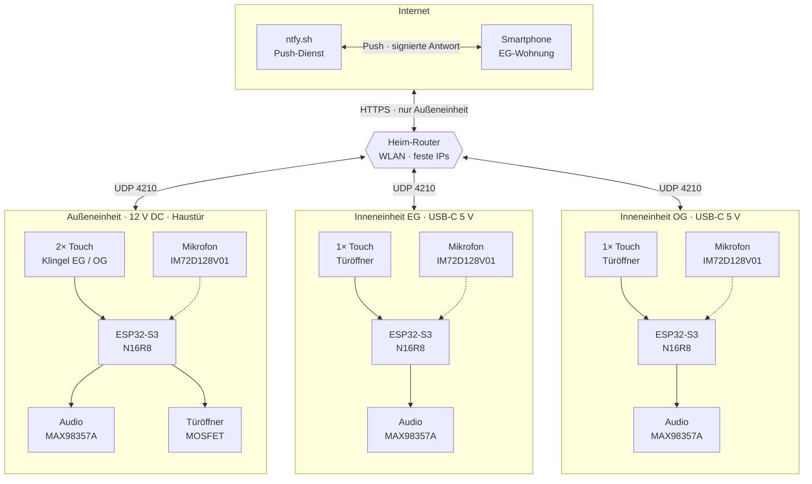
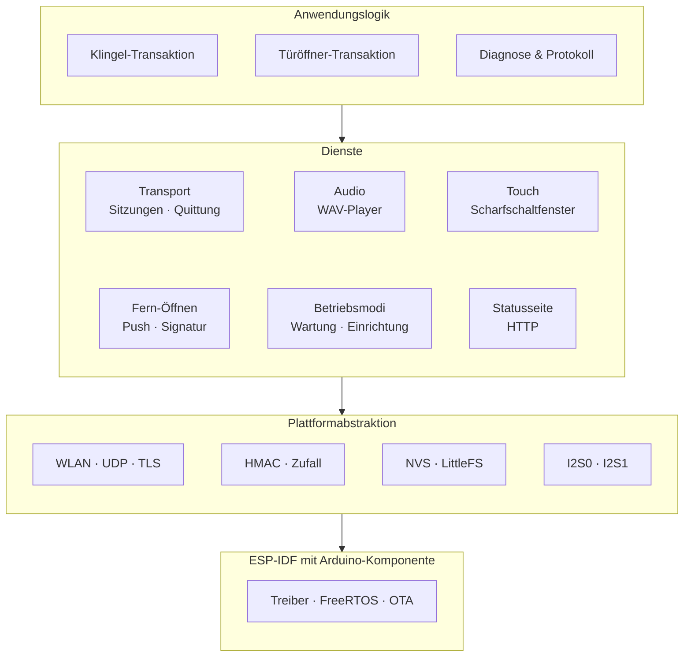
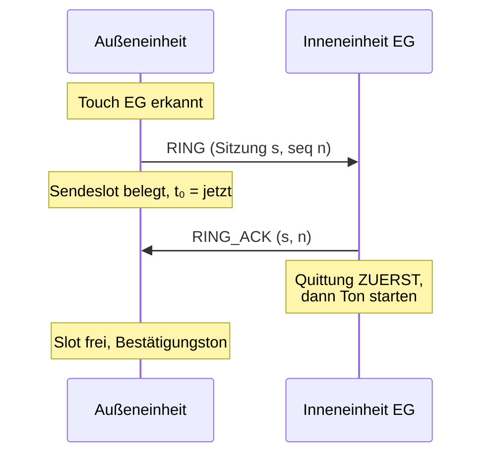
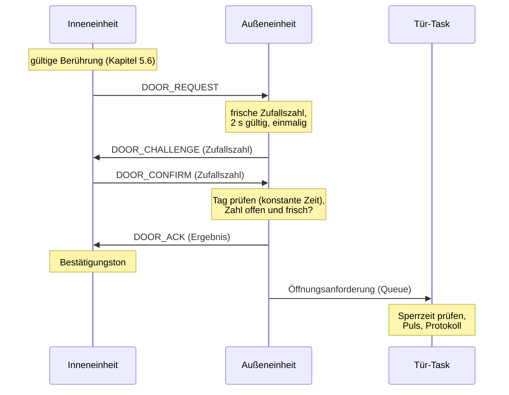
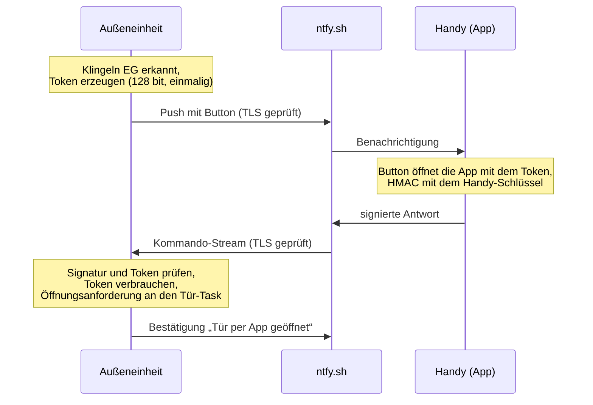
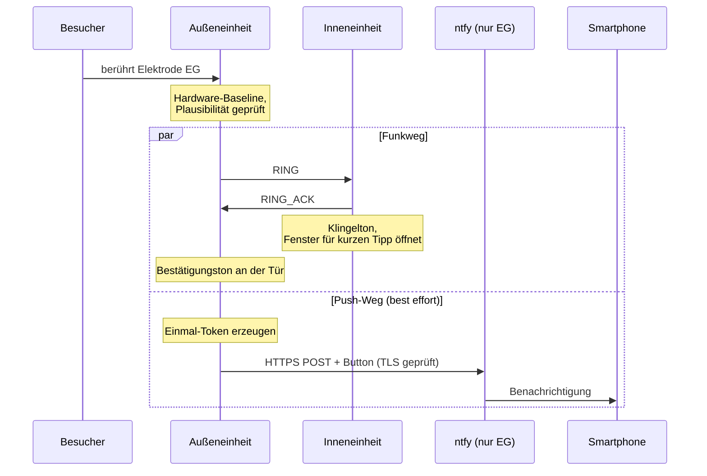
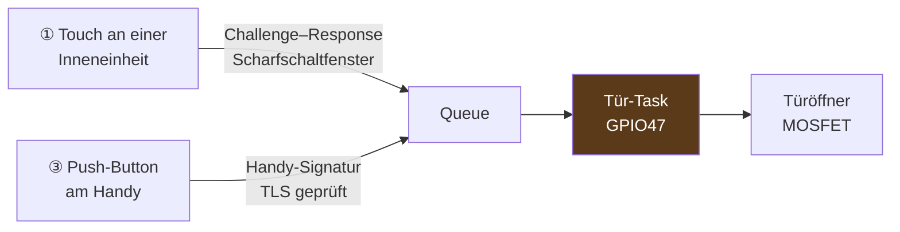
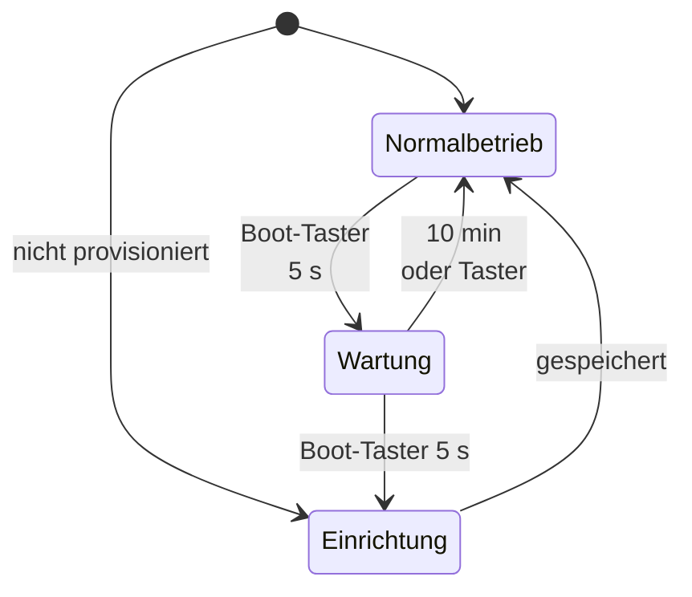
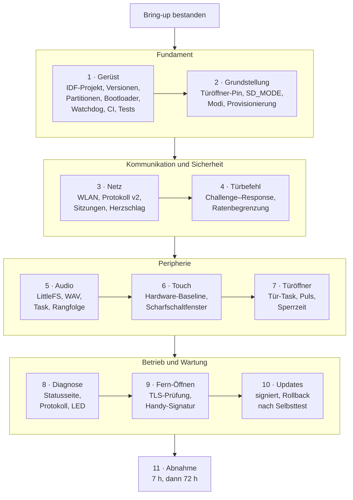

# ClearBell V0.2 — Softwarearchitektur und Firmware-Plan

> **Dokumenttyp:** Architektur- und Entwurfsdokument für die Firmware der Generation V0.2 · **Revision 2**
> **Stand:** 26.09.2026 · **Hardware:** in Fertigung · **Firmware:** Portierung noch nicht begonnen
> **English version:** [`Softwarearchitektur_V0.2.en.md`](Softwarearchitektur_V0.2.en.md)

---

## 0. Was dieses Dokument ist — und was es nicht ist

ClearBell ist ein selbst entwickeltes Türklingelsystem für ein Zweifamilienhaus: eine Außeneinheit an der
Haustür, zwei baugleiche Inneneinheiten, Kommunikation über WLAN/UDP ohne eigenen Server und ohne Broker. Die
Hardware der Generation V0.2 ist fertig konstruiert und in Fertigung; die Firmware für diese Hardware existiert
noch nicht.

Dieses Dokument beschreibt **die Software, die auf diese Platinen kommt**: Architektur, Laufzeitverhalten,
Sicherheitskonzept, Datenhaltung, Teststrategie und den Weg von der laufenden V0.1-Firmware dorthin.

**Revision 2** ist das Ergebnis eines Reviews der ersten Fassung, das alles in Frage stellen durfte außer den
äußeren Umständen — eine Außeneinheit, zwei Inneneinheiten, die gefertigte Hardware, Push-Benachrichtigung aufs
Smartphone. Es fand 29 Befunde, darunter drei Wege zur Haustür, gegen die die sorgfältig gebaute Kryptografie
nichts ausrichtete. Die sieben Entscheidungen, die daraus folgten, sind hier eingearbeitet und im Projekt als
Designentscheidungen R17–R23 festgehalten. Kapitel 16 zeigt, was sich geändert hat.

**Drei Dinge sind durchgehend getrennt:**

| Kennzeichnung | Bedeutung |
|---|---|
| **[V0.1 — läuft]** | Im Haus im Dauerbetrieb, gemessen oder im Test bestätigt. Quelle ist der reale Quelltext. |
| **[V0.2 — Entwurf]** | Festgelegtes Soll für die kommende Firmware. Noch nicht implementiert, noch nicht gemessen. |
| **[offen]** | Bewusst noch nicht entschieden. Sammelstelle ist Kapitel 12. |

Das ist keine Formalität. Ein Architekturdokument, das Geplantes wie Erreichtes aussehen lässt, ist wertlos —
und in diesem Projekt wurden die teuersten Fehler alle dadurch gefunden, dass Annahmen gegen die Realität geprüft
wurden statt umgekehrt. Aussagen über die Plattform in diesem Dokument sind gegen den tatsächlich installierten
Arduino-ESP32-Core 3.3.10 geprüft, nicht gegen seine Dokumentation.

**Nicht enthalten:** Netzwerknamen, Passwörter, kryptografische Schlüssel, Push-Topics und MAC-Adressen. Diese Werte
sind Betriebsgeheimnisse der konkreten Installation, nicht Teil der Architektur.

---

## 1. Systemüberblick

### 1.1 Topologie



Die Mikrofone sind gestrichelt, weil sie in V0.2 bestückt, aber ohne Funktion sind (Kapitel 5.7).

### 1.2 Rollen und Zuständigkeiten

| | Außeneinheit (1×) | Inneneinheit (2×, baugleich) |
|---|---|---|
| **Löst aus** | Klingeln EG, Klingeln OG | Türöffner-Anfrage |
| **Führt aus** | Türöffner-Puls, Push-Versand | Klingelton-Wiedergabe |
| **Prüft** | Türbefehle der Inneneinheiten (Challenge–Response) und Fern-Öffnungen vom Handy (Signatur) | Klingeln und Quittungen der Außeneinheit |
| **Kennt Schlüssel** | je einen Verbindungsschlüssel zu EG und OG, dazu die Handy-Schlüssel | nur den eigenen Verbindungsschlüssel |
| **Protokolliert** | Fern-Öffnungen einzeln, Touch-Öffnungen nur als Summe | die Öffnungen der eigenen Wohnung |
| **Speisung** | 12 V DC (SELV) | USB-C 5 V |
| **Besonderheit** | zusätzliche Service-USB-C; trägt die Türöffner-Ansteuerung | Versorgung und Programmierung über dieselbe Buchse |

**Zwei unabhängige Klingelwege.** Der EG-Taster erreicht ausschließlich die EG-Einheit, der OG-Taster ausschließlich
die OG-Einheit. Kein Broadcast, keine Gruppenlogik — jedes Klingeln ist eine eigenständige Transaktion zu genau
einem Ziel. Der **Türöffner dagegen ist gemeinsam**: beide Wohnungen öffnen dieselbe Haustür.

Diese Asymmetrie prägt das Sicherheitskonzept (Kapitel 7): Ein fehlgeschlagenes Klingeln ist ein Ärgernis, ein
fälschlich ausgelöster Türöffner ist ein Einbruch. Zugleich sind die beiden Wohnungen zwei **getrennte Haushalte** —
was die eine Einheit protokolliert, geht die andere nichts an (Kapitel 6.4).

### 1.3 Qualitätsziele

| Ziel | Messgröße | Zielwert | Stand |
|---|---|---|---|
| **Die Tür öffnet nur berechtigt** | Auslösepfade ohne Authentifizierung | **0** | Entwurf — Kapitel 5.4, 7 |
| **Nichts geht still verloren** | Nachrichten, die quittiert, aber nicht ausgeführt werden | **0** | Entwurf — Kapitel 4.3 |
| Klingeln kommt an | Berührung außen → Klingelton innen | ≤ 0,5 s | im Bring-up messen |
| Fehlschlag wird gemeldet | Berührung → Fehlerton an der Tür, wenn die Wohnung nicht antwortet | ≤ 1,5 s | V0.1: ≈ 1,2 s |
| Türbefehl | Loslassen innen → Türöffner-Puls | ≤ 1 s | im Bring-up messen |
| Selbstheilung | WLAN zurück → betriebsbereit, ohne Neustart | ≤ 30 s | im Bring-up messen |
| Dauerbetrieb | ohne Neustart, freier Heap stabil | 7 h als Tor für P6, ≥ 72 h vor dem Einbau | V0.1: 7 h bestanden |
| Updates | ein fehlerhaftes Update | kehrt selbst zur Vorversion zurück | Entwurf — Kapitel 8.1 |
| Datenschutz | Mikrofon im Normalbetrieb | aus | Entwurf — Kapitel 5.7 |

Die Zielwerte sind Festlegungen dieses Entwurfs, keine Messwerte. Sie werden im Bring-up gemessen und dort bestätigt
oder begründet angepasst.

---

## 2. Plattform und Randbedingungen

### 2.1 Zielplattform

| | Wert | Anmerkung |
|---|---|---|
| Modul | ESP32-S3-WROOM-1-**N16R8** | 16 MB Flash, 8 MB Octal-PSRAM |
| Build | **ESP-IDF-Projekt mit Arduino-ESP32 als Komponente** | Arduino-API im Code, Konfiguration (`sdkconfig`) in eigener Hand |
| Versionen | als Paar fixiert; der bisher genutzte Arduino-Core 3.3.10 baut auf ESP-IDF 5.5.4 | Zuordnung beim Aufsetzen gegen die Release-Hinweise prüfen; die Komponente verlangt `CONFIG_FREERTOS_HZ=1000` |
| Konfiguration | `sdkconfig.defaults` und `partitions.csv` im Repo | jeder Build ist reproduzierbar |
| Audio | `ESP_I2S` + eigener WAV-Player | bewusst **nicht** `ESP32-audioI2S` |
| Dateisystem | LittleFS im internen Flash | die SD-Karte entfällt gegenüber V0.1 |
| Programmierung | natives **USB-Serial-JTAG** (GPIO19/20) | Flashen, Konsole und Debugging über eine Buchse |
| Update | Dual-OTA, **signiert**, Rollback **nach Selbsttest** | Kapitel 8.1 |

**Warum ESP-IDF statt Arduino IDE.** Im vorkompilierten Arduino-Core sind Secure Boot, Flash-Verschlüsselung,
NVS-Verschlüsselung, Anti-Rollback und signierte Updates ausgeschaltet und nicht einschaltbar; Espressif verweist
dafür selbst auf „Arduino as component“. Als IDF-Projekt ist die gesamte Sicherheitskonfiguration erreichbar,
ohne den Arduino-Code aufzugeben. **Erreichbar heißt nicht eingeschaltet** — was irreversibel ist, folgt den
Härtungsstufen in Kapitel 7.7.

**Warum kein `ESP32-audioI2S`.** Die Bibliothek setzt PSRAM voraus und zieht Decoder mit, die das Projekt nicht
braucht. Der eigene Player liest 16-Bit-PCM blockweise und schiebt es nach I2S — das ist der gesamte benötigte
Funktionsumfang. Auch mit dem PSRAM des S3 bleibt das die richtige Wahl.

### 2.2 Harte Randbedingungen, die die Software binden

Diese Punkte folgen aus Datenblättern und aus der gefertigten Platine:

| Randbedingung | Konsequenz für die Software |
|---|---|
| **GPIO35/36/37 sind Octal-PSRAM** | dürfen nirgends konfiguriert werden — sonst schwer diagnostizierbare Boot-Fehler |
| **PDM-Empfang nur auf I2S0, nur 16 bit** | Mikrofon zwingend auf **I2S0**, Verstärker auf **I2S1** |
| **GPIO19/20 = USB** | nicht anderweitig verplanbar |
| **GPIO0/3/45/46 = Strapping** | nur GPIO0 wird bewusst benutzt (Boot-Taster) — und nur im laufenden Betrieb: beim Einschalten gedrückt, startet der Chip in den Download-Modus |
| **GPIO39–42 (JTAG) ohne Kupfer** | kein externer JTAG-Adapter; Debugging mit GDB/OpenOCD läuft über das eingebaute USB-JTAG an GPIO19/20 |
| **Kein Deep Sleep möglich** | beide Einheiten sind UDP-Empfänger — wer schläft, öffnet die Tür nicht |
| **Türöffner-Gate ist nach Reset hochohmig** | die Firmware zieht den Pin **vor allem anderen** auf LOW (Kapitel 5.1) |
| **Die Türöffner-Ansteuerung sitzt in der Außeneinheit** | physischer Zugriff auf die Außeneinheit ist Zugriff auf die Tür — dagegen hilft keine Firmware, sondern die Montage (Kapitel 7.5) |

### 2.3 Pinbelegung V0.2

Beide Einheiten teilen sich bewusst **einen** Satz Pin-Konstanten. Wo eine Funktion innen nicht existiert, bleibt
der Pin unbelegt — statt die Belegung zu verschieben.

| Funktion | GPIO | Außen | Innen | Richtung |
|---|---|---|---|---|
| Touch Klingel EG / Türöffner-Taster | **4** | Klingel EG | Türöffner | analog in |
| Touch Klingel OG | **5** | Klingel OG | — | analog in |
| *Reserve Guard / Shield* | 6 / 14 | freihalten | freihalten | — |
| I2S1 BCLK → Verstärker | **15** | ✓ | ✓ | out |
| I2S1 WS/LRCLK → Verstärker | **16** | ✓ | ✓ | out |
| I2S1 DOUT → Verstärker | **17** | ✓ | ✓ | out |
| Verstärker `SD_MODE` (Mute) | **7** | ✓ | ✓ | out |
| I2S0 PDM CLK → Mikrofon | **38** | ✓ | ✓ | out |
| I2S0 PDM DATA ← Mikrofon | **21** | ✓ | ✓ | in |
| **Türöffner-Gate** | **47** | ✓ | *unbelegt* | out |
| Status-LED rot | **48** | ✓ | ✓ | out |
| Status-LED grün | **18** | ✓ | ✓ | out |
| USB D− / D+ | 19 / 20 | Service-Buchse | Versorgung + Daten | — |
| Boot / Reset | 0 / EN | Taster | Taster | — |
| UART0 TXD0 / RXD0 | 43 / 44 | Testpunkte | Testpunkte | Rückfallweg |

**Frei als Reserve:** GPIO1, 2, 8, 9, 10, 11, 12, 13 — im Schaltplan mit No-Connect-Flag gesperrt. „Reserve“ heißt
ausdrücklich *bei V0.3 neu entscheiden*, nicht *jederzeit frei belegbar*.

Die Pin-Konstanten im Code tragen **genau die Netznamen des Schaltplans** — auch dort, wo diese deutsche Kürzel
enthalten (EG/OG für die beiden Wohnungen). Das verhindert Übertragungsfehler zwischen Hardware und Software.
Alle Pin-Definitionen aus V0.1 sind ungültig; nichts davon wird übernommen.

---

## 3. Softwarearchitektur

### 3.1 Schichten



Die Schichtung existiert, damit die **Anwendungslogik ohne Hardware testbar bleibt**: Klingel- und
Türöffner-Transaktion, Protokoll, WAV-Parser und Zustandsautomaten laufen als Unit-Tests auf dem PC
(Kapitel 11.3). In V0.1 war es genau diese Trennung, die den Protokolltest vom Produktivcode trennbar gemacht hat.

### 3.2 Ausführungsmodell

Vier Grundregeln:

1. **Die Hauptschleife blockiert nie.** [V0.1 — läuft, wird übernommen] Alles, was länger als wenige Millisekunden
   dauern kann — WLAN-Verbindungsaufbau, TLS, Audio, Uploads —, läuft zustandsbehaftet in der Schleife oder in einem
   eigenen Task.
2. **Jede Ressource hat genau einen Eigentümer.** Andere Kontexte stellen nur Anforderungen in dessen Queue. Vor
   allem der Türöffner: Weder der Touch-Pfad noch das Fern-Öffnen fassen GPIO47 selbst an.
3. **Übergaben nur per FreeRTOS-Queue.** Eine `volatile`-Flagge ist auf einem Zweikern-Prozessor keine
   Synchronisation. V0.1 teilte so Push-Puffer und Token-Tabelle zwischen Schleife und Task — eine zweite Push konnte
   die erste mitten im Senden überschreiben.
4. **Alles hängt am Watchdog.** Die Leerlauf-Tasks beider Kerne und jeder eigene Task werden überwacht. Ab Werk
   überwacht der Arduino-Core die Hauptschleife nicht — das wird ausdrücklich eingeschaltet.

| Kontext | Inhalt | Eigentümer von |
|---|---|---|
| **Hauptschleife** | Transport (UDP, Sitzungen, Wiederholungen, Herzschlag), Touch, Betriebsmodi, LED | Sendeslots, Touch-Zustand |
| **Task `door`** *(außen)* | nimmt Öffnungsanforderungen an, prüft die Sperrzeit, erzeugt den Puls, protokolliert | **GPIO47** |
| **Task `audio`** | Dateisystem lesen, I2S1 füttern, Verstärker schalten | I2S1, `SD_MODE` |
| **Task `remote`** *(außen)* | Klingel-Push senden, Kommando-Stream halten, Tokens ausgeben und prüfen | Token-Tabelle |
| **HTTP-Server** (IDF) | Statuswebseite, in eigenem Task | — |

Der HTTP-Server der ESP-IDF läuft ohnehin in einem eigenen Task. Das ist ein Grund mehr für den IDF-Build: Der
Arduino-`WebServer` liest jede Anfrage samt Upload innerhalb der aufrufenden Schleife — ein Klingelton von 400 KB
hätte sie sekundenlang blockiert.

> **Ungeprüft:** Ob `i2s.write()` bei vollem DMA-Puffer blockiert und damit die Taktung des Audio-Tasks selbst
> bestimmt, ist nie gemessen worden. Das gehört in den Bring-up (Kapitel 11.1).

### 3.3 Modulschnitt [V0.2 — Entwurf]

V0.1 ist eine einzelne `.ino` mit 731 Zeilen — für die Erprobung richtig, für V0.2 nicht mehr tragfähig.

| Modul | Verantwortung |
|---|---|
| `config.h` | Pins (Netznamen des Schaltplans), Zeitkonstanten, Einheitentyp — **keine Geheimnisse** |
| `cb_provisioning` | liest Rolle, Schlüssel und WLAN-Zugang aus der Werkszustand-Partition; Einrichtung, Werksreset |
| `cb_protocol` | Rahmen v2, Serialisierung, HMAC, Sitzungen, Challenge–Response |
| `cb_transport` | UDP, Sendeslots, Wiederholungen, Herzschlag, Ratenbegrenzung |
| `cb_audio` | WAV-Parser, Wiedergabe, Prioritäten, Lautstärke, `SD_MODE` |
| `cb_touch` | Hardware-Baseline, Plausibilität, Scharfschaltfenster |
| `cb_door` *(außen)* | Türöffner-Task — **der einzige Ort, der GPIO47 anfasst** |
| `cb_remote` *(außen)* | Push, Tokens, Kommando-Stream, Handy-Signaturen |
| `cb_status` | LED, Statusseite, Protokoll der Türöffnungen, Zähler |
| `cb_modes` | Normalbetrieb, Wartung, Einrichtung |
| `cb_ota` | Update annehmen, Signatur prüfen, Selbsttest, Rollback |

Es gibt **ein Firmware-Image je Einheitentyp** (außen, innen). EG und OG unterscheiden sich nur durch die
Provisionierung — kein Image enthält ein Geheimnis.

Die Isolation von `cb_door` ist Absicht: Wenn genau ein Task den Türöffner-Pin schaltet, ist die Prüfung „wer kann
die Tür öffnen?“ eine Textsuche und keine Codeanalyse.

---

## 4. Kommunikationsprotokoll

### 4.1 Transportentscheidung

**WLAN + UDP direkt zwischen den Einheiten über den Heim-Router.** Kein MQTT-Broker, kein Raspberry Pi, keine Cloud.

ESP-NOW wurde nicht aus Geschmacksgründen verworfen, sondern nach einer vollständigen Funkvalidierung an den echten
Montageorten: Die Strecke war dort funktional tot, alle Hebel (Kanalwahl, Sendeleistung, Antennenausrichtung) waren
ausgereizt. Die Messwerte stehen in [`Funkvalidierung_ESPNOW.md`](Funkvalidierung_ESPNOW.md). Der WLAN/UDP-Unterbau
hat anschließend einen siebenstündigen Dauertest ohne Paketverlust und ohne Neustart bestanden.

UDP hat keine Transportbestätigung. **Das einzige Erfolgskriterium ist deshalb die Anwendungsquittung** — nicht
„gesendet“, sondern „der Empfänger hat bestätigt, dass er es verarbeitet hat“.

### 4.2 Protokoll v2 [V0.2 — Entwurf]

V0.1 nutzte ein 14-Byte-Paket, in dem nur der Türbefehl authentifiziert war. Version 2 authentifiziert **jede**
Nachricht, erkennt Neustarts des Senders und lässt spätere Änderungen zu.

| Feld | Bytes | Zweck |
|---|---|---|
| `magic` = `CB` | 2 | Fremdpakete ohne Rechenaufwand verwerfen |
| `version` | 1 | spätere Änderungen ohne Bruch — die Geräte werden nacheinander aktualisiert |
| `type` · `sender` · `receiver` | 3 | Empfänger im Paket: ein für EG bestimmtes Paket gilt nicht bei OG |
| `session` | 4 | Zufallszahl je Start des Senders (Kapitel 4.3) |
| `seq` | 4 | laufend innerhalb der Sitzung |
| `payload` | 0…n | z. B. Zufallszahl, Ergebnis |
| `tag` | 16 | HMAC-SHA256 über `"CBv2"` ‖ alle Felder davor, auf 128 bit gekürzt |

**Regeln:**

* **Schlüssel je Verbindung** — Außen↔EG und Außen↔OG haben je einen eigenen. EG und OG teilen keinen Schlüssel und
  können einander nicht fälschen.
* **Feste Byte-Reihenfolge** (Little Endian) und Serialisierung über eigene Funktionen, nicht über `packed struct`.
* **Prüfreihenfolge beim Empfang:** Länge und `magic` → Ratenbegrenzung je Absender → Version → Tag (konstante
  Laufzeit) → Sitzung und `seq`. Was scheitert, wird verworfen, ohne es zu beantworten.
* **Versionen:** Jede Einheit versteht ihre eigene und die vorige Version.
* **Warum 128 bit:** NIST lässt Kürzungen bis 32 bit zu; die Fälschungswahrscheinlichkeit ist (1/2)^(λ − t) bei 2^t
  erlaubten Fehlversuchen. 64 bit würden mit Ratenbegrenzung reichen — 128 bit nehmen die Frage für 8 Byte vom Tisch.

**Nachrichtentypen:**

| Typ | Richtung | Zweck | V0.1 |
|---|---|---|---|
| `PING` / `PONG` | beide | Herzschlag alle 30 s; baut Sitzungen auf | vorhanden, nie gesendet |
| `RING` / `RING_ACK` | außen → innen / zurück | Klingeln | `KLINGEL` / `KLINGEL_QUITT` |
| `DOOR_REQUEST` | innen → außen | Türbefehl anfordern | — |
| `DOOR_CHALLENGE` | außen → innen | frische Zufallszahl | — |
| `DOOR_CONFIRM` | innen → außen | gibt die Zufallszahl zurück; das Tag beweist den Schlüssel | `TUER_AUF` (mit Zähler) |
| `DOOR_ACK` | außen → innen | Ergebnis | `TUER_QUITT` |

### 4.3 Quittung, Wiederholung, Sitzungen



| Parameter | Wert | Begründung |
|---|---|---|
| Quittungs-Timeout | **300 ms** | im Funktest als sicher über der Laufzeit belegt [V0.1 — läuft] |
| Wiederholungen | **max. 3** | danach gilt die Sendung als endgültig verloren |
| Zeit bis „Fehler“ | **≈ 1,2 s** | Erstsendung + 3 Wiederholungen à 300 ms |
| Gleichzeitige Sendungen | **3 Slots** | Klingel EG und OG können sich überlappen |

**Die Quittung geht vor der Nutzaktion raus.** Die Inneneinheit antwortet erst und startet dann den Klingelton;
umgekehrt würde die Tonausgabe das Quittungsfenster des Senders auffressen.

**Sitzungen und Duplikate.** Jede Einheit würfelt bei jedem Start eine neue Sitzungsnummer. Ein Duplikat ist eine
Nachricht mit **gleicher Sitzung und gleicher Nummer** wie eine bereits verarbeitete; sie wird nicht erneut
ausgeführt, **aber trotzdem quittiert** — der häufigste Grund für ein Duplikat ist eine verlorene Quittung.

Der Grund für die Sitzungsnummer ist ein Fehler aus V0.1: Dort begann der Klingelzähler bei jedem Start bei 0, und
die Inneneinheit erkannte ein Duplikat nur an der gleichen Nummer. Nach einem Neustart der Außeneinheit konnte ein
Klingeln so **quittiert, aber nicht abgespielt** werden — der Besucher hörte den Erfolgston, drinnen klingelte nichts.

**Neue Sitzungen** werden durch den Herzschlag bestätigt: Nach dem Start meldet sich jede Einheit sofort bei ihren
Gegenstellen. Trifft trotzdem eine Nachricht mit unbekannter Sitzung ein, antwortet der Empfänger mit einer
Herausforderung, und die Wiederholung des Senders kommt durch — schlimmstenfalls 300 ms später. Ein aufgezeichnetes
Paket einer alten Sitzung scheitert an dieser Herausforderung.

**Herzschlag:** alle 30 s; nach drei ausgebliebenen Antworten gilt die Gegenstelle als nicht erreichbar (LED rot).
So weiß die Außeneinheit schon vor dem nächsten Klingeln, dass eine Wohnung nicht erreichbar ist.

### 4.4 Türbefehl per Challenge–Response



| Eigenschaft | Umsetzung |
|---|---|
| **Echtheit** | das Tag jeder Nachricht (Kapitel 4.2), eigener Schlüssel je Wohnung |
| **Frische** | Zufallszahl aus dem Hardware-Zufallsgenerator — echt zufällig, solange der Funk aktiv ist —, 2 s gültig, einmalig |
| **Replay** | ausgeschlossen: eine aufgezeichnete Bestätigung passt zu keiner neuen Zufallszahl |
| **Kein dauerhafter Zustand** | kein Zähler im NVS — nach einem Neuflashen kann nichts auseinanderlaufen |
| **Quittung vor Aktion** | `DOOR_ACK` geht hinaus, dann übernimmt der Tür-Task |

**Warum nicht mehr der Zähler aus V0.1.** V0.1 schützte den Türbefehl mit einem streng steigenden Zähler im NVS
beider Seiten. Das hat zwei Schwächen: Verliert die Außeneinheit ihr NVS, gelten aufgezeichnete Befehle wieder;
verliert eine Inneneinheit ihr NVS — etwa durch vollständiges Neuflashen —, beginnt ihr Zähler bei 1, und die
Außeneinheit verwirft jeden ihrer Befehle als Wiederholung, praktisch für immer. Challenge–Response hat beide
Probleme nicht.

**Kosten:** eine zusätzliche Hin- und Rückrunde im LAN. Mit Modem-Sleep kann jeder Schritt auf das nächste
DTIM-Signal des Routers warten — die Zeit bis zum Puls wird im Bring-up gemessen (Ziel ≤ 1 s, Kapitel 1.3).

### 4.5 Fern-Öffnen per Push [V0.2 — Entwurf]

Der Anwendungsfall ist konkret: Ein Kind steht ausgesperrt vor der Tür, kein Erwachsener ist zu Hause.



| Eigenschaft | Umsetzung |
|---|---|
| **Das Handy signiert** | HMAC-SHA256 über das Token mit einem Schlüssel, der nur auf diesem Handy und in der Außeneinheit liegt; die Nachricht trägt eine Verfahrenskennung |
| **Je Handy ein Schlüssel** | einzeln sperrbar, etwa bei Verlust |
| **Token** | 128 bit, einmalig, an genau ein Klingeln gebunden; Gültigkeit wird im Bring-up festgelegt — 5 min sind vertretbar, weil das Token ohne Handy-Schlüssel wertlos ist |
| **TLS** | Zertifikatsprüfung gegen das im Core eingebettete Zertifikatsbündel (Mozilla-Liste); kein Pinning — die Serverzertifikate wechseln alle paar Wochen |
| **Topics** | dürfen öffentlich bleiben; ntfy.sh ist nur noch Transportweg |
| **Nachvollziehbar** | jede Fern-Öffnung wird per Push bestätigt und protokolliert (Kapitel 6.4) |

**Warum so.** In V0.1 stand das Einmal-Token in der Push selbst. Auf ntfy.sh ist ein Topic ohne bezahlte Reservierung
öffentlich — „the topic is essentially a password“ —, und Nachrichten werden 12 Stunden vorgehalten. Wer das
Melde-Topic las, hielt damit ein gültiges Öffnungs-Token in der Hand. Zugriffsschutz auf ntfy.sh kostet Geld oder
einen eigenen, aus dem Internet erreichbaren Server. Die Handy-Signatur löst das Problem kostenlos und nimmt dabei
auch den Dienstbetreiber aus der Vertrauenskette.

**Plattformen.** Android: Die App „HTTP Shortcuts“ hat eine eingebaute HMAC-Funktion und nimmt über Deep Links Werte
entgegen — der Button der Push öffnet sie mit dem Token. iOS: Die Kurzbefehle-App kennt nach den verfügbaren
Beschreibungen kein HMAC, nur einfache Hashes; wie dort signiert werden kann, ist [offen]. Die Verfahrenskennung hält
den Weg für ein zweites Verfahren offen, ohne Android zu brechen.

---

## 5. Laufzeitverhalten — was wann passiert

### 5.1 Startsequenz [V0.2 — Entwurf, sicherheitskritisch]

Grundsatz: **erst alles in einen sicheren Zustand bringen, dann Funktionen aktivieren.**

| # | Schritt | Warum an dieser Stelle |
|---|---|---|
| 1 | **GPIO47 als Ausgang, LOW** *(außen)* | Der Pin ist nach Reset hochohmig; bis die Firmware ihn definiert, hält ihn nur der 100-kΩ-Pull-down am Gate. Allererste Anweisung. |
| 2 | **Verstärker stumm** (`SD_MODE` LOW) | kein Einschaltknacken; der Pull-down hält ihn schon während des Bootens stumm |
| 3 | Status-LED aus | „dunkel“ heißt *Firmware läuft noch nicht* |
| 4 | Logging über USB-CDC | ab hier ist Diagnose möglich |
| 5 | Neustartgrund und Startzähler lesen | ein unerwarteter Neustart der Außeneinheit wird später per Push gemeldet (Kapitel 7.5) |
| 6 | Werkszustand-Partition prüfen | nicht provisioniert → Einrichtung (Kapitel 5.9); sonst Rolle und Schlüssel laden |
| 7 | NVS-Einstellungen, Schema-Version prüfen | nach einem Update ggf. Daten migrieren |
| 8 | LittleFS einhängen | schlägt es fehl, läuft das Gerät stumm weiter |
| 9 | I2S1 (Verstärker) konfigurieren | noch keine Ausgabe |
| 10 | **Mikrofon nicht starten** | kein Takt, keine Daten — Kapitel 5.7 |
| 11 | Touch initialisieren, Baseline einlernen | braucht eine kurze Ruhephase ohne Berührung |
| 12 | WLAN starten — ereignisgesteuert, nicht blockierend | das Gerät muss auch ohne Netz betriebsbereit werden |
| 13 | Tasks starten, alle am Watchdog anmelden | `door`, `audio`, `remote`, HTTP-Server |
| 14 | Update-Selbsttest, falls ein neues Image läuft | bestätigt wird erst, wenn WLAN und Gegenstelle antworten (Kapitel 8.1) |
| 15 | LED auf den ersten echten Zustand setzen | ab jetzt sagt die Anzeige die Wahrheit |

Schritt 1 ist der Kern der Anforderung „Der Türöffner darf niemals durch Boot, Reset oder Brownout auslösen“:
hardwareseitig durch den Pull-down, softwareseitig durch diese Reihenfolge — **beides zusammen**.

### 5.2 Hauptschleife

Ein Durchlauf, feste Reihenfolge, kein Schritt blockiert:

| Schritt | Zweck |
|---|---|
| Transport | ein UDP-Paket annehmen (ratenbegrenzt), Sitzungen, fällige Wiederholungen, Herzschlag |
| Touch | Hardware-Werte auswerten, Plausibilität, Scharfschaltfenster, Anforderungen stellen |
| Betriebsmodi | Boot-Taster, Zeitfenster der Wartung |
| LED | Statusfarbe nachführen |
| Watchdog | Lebenszeichen |

Audio, Push, Kommando-Stream, Türöffner und Statusseite laufen in ihren Tasks (Kapitel 3.2).

### 5.3 Klingelablauf — vollständig



**Der Push-Weg blockiert den Funkweg nicht.** Er läuft im eigenen Task und ist ausdrücklich Best-Effort: Ohne
Internet wird er übersprungen, ohne dass der Besucher davon etwas merkt. Was geschieht, wenn jemand in der
Benachrichtigung auf den Button tippt, zeigt Kapitel 4.5: Das Handy signiert, die Außeneinheit prüft und öffnet.

| Ereignis | Zeitpunkt |
|---|---|
| Berührung erkannt | nach mehrfach bestätigter Messung, Größenordnung 100 ms (V0.1-Wert, am S3 neu zu messen) |
| Quittung zurück | typisch wenige ms, mit Modem-Sleep bis zum nächsten DTIM-Signal |
| Bestätigungston an der Tür | praktisch sofort nach der Quittung |
| **Fehlerton** (Wohnung aus / kein WLAN) | **erst nach ≈ 1,2 s** — vorher steht der Fehlschlag nicht fest |
| ohne WLAN | sofort Fehlerpfad, kein Sendeversuch |

Dass der Fehlerton spät kommt, ist kein Mangel, sondern die Konsequenz aus „Quittung ist das einzige
Erfolgskriterium“.

### 5.4 Türöffner — zwei Auslösepfade



| Pfad | Wer | Schutz |
|---|---|---|
| **①** Touch an einer Inneneinheit | Bewohner zu Hause | Challenge–Response (Kapitel 4.4), Touch-Plausibilität und Scharfschaltfenster (Kapitel 5.6) |
| **②** ~~Statusseite, HTTP POST~~ | — | **entfallen:** Er hatte keine Authentifizierung — „nur POST, nur lokales Netz“ schützt weder gegen ein fremdes Gerät im WLAN noch gegen Cross-Site-Request-Forgery. Die Statusseite öffnet die Tür nicht, auch nicht mit Passwort. |
| **③** Push-Button am Handy | Bewohner unterwegs | Handy-Signatur, TLS-Prüfung, Einmal-Token (Kapitel 4.5) |

Die Nummern bleiben erhalten, damit Verweise eindeutig bleiben; ② wird nicht neu vergeben.

**Der Tür-Task** ist der einzige Eigentümer von GPIO47 (Kapitel 3.2):

* Er nimmt Anforderungen aus seiner Queue — gleich, von welchem Pfad.
* Er setzt das Gate und beendet den Puls über einen **Hardware-Timer**, also auch dann, wenn die Schleife hängt; dazu
  eine harte Obergrenze der Einschaltdauer.
* Nach jeder Öffnung gilt eine **Sperrzeit für alle Pfade**.
* Jede Öffnung wird protokolliert (Kapitel 6.4); eine Fern-Öffnung zusätzlich per Push bestätigt.

Die Pulsdauer ist [offen] (Kapitel 12). Der Türöffner-Trockentest im Bring-up läuft über einen Seriell-Befehl am USB,
also nur mit physischem Zugang zum Gerät — nie über das Netz.

### 5.5 Audio

**Ablauf:** Datei öffnen → RIFF/WAVE parsen (`fmt `- und `data`-Chunk suchen, unbekannte Chunks überspringen) →
Abtastrate mit der aktuellen I2S-Konfiguration vergleichen und nur bei Abweichung neu konfigurieren → Verstärker
freigeben → Wiedergabe im Audio-Task.

| Eigenschaft | V0.1 | V0.2 |
|---|---|---|
| Quelle | SD-Karte (FAT32, SPI) | **LittleFS** im internen Flash |
| Format | WAV, 16 bit PCM | unverändert |
| Blockgröße | 512 Byte lesen, bei Mono als 1 KB Stereo an I2S | unverändert, im Audio-Task |
| Lautstärke | digitale Skalierung 0–100 % vor I2S | unverändert |
| Stufen | 15 / 30 / 50 / 75 / 100 %, per Boot-Taster, in NVS | unverändert (kurzer Druck) |
| Verstärker | dauerhaft aktiv | **`SD_MODE` schaltet ihn bei Bedarf** |
| Vorrang | der neueste Ton ersetzt den laufenden | **Rangfolge:** Klingeln > Fehler > Erfolg > Bedien-Rückmeldung |

Die digitale Absenkung sitzt bewusst **vor** I2S: Der MAX98357A hat keine Lautstärkeregelung; sein `GAIN`-Pin setzt
nur den Clipping-Punkt (hier 12 dB gegen GND). Nach dem Freigeben über `SD_MODE` braucht der Verstärker einen Moment,
bevor der Ton sauber einsetzt — der Audio-Task beginnt deshalb mit Stille; die nötige Vorlaufzeit wird im Bring-up
bestimmt.

Fehlt eine Datei oder ist sie kein 16-Bit-WAV, läuft das Gerät stumm weiter und protokolliert. **Audio ist nie ein
Grund für einen Absturz** — die Klingel muss auch ohne Ton noch die Tür öffnen können.

### 5.6 Touch

Die Bronzeelektroden liegen **frei zugänglich**, nicht hinter Holz. Das bringt einen großen Signalhub, setzt die
Elektrode aber Kondenswasser und Schmutzfilm direkt aus; ein Vordach nimmt den Schlagregen, nicht die Betauung.
Shield-Kanal und Guard-Ring wurden bewusst verworfen (sie bräuchten zusätzliche Elektroden).

**Die Hardware bringt die Grundlage mit.** Der Touch-Treiber des Cores nutzt auf dem S3 den neuen IDF-Treiber mit
**Hardware-Baseline** („benchmark“), Hardware-Filter und Schwellen relativ zur Baseline (Voreinstellung 1,5 %); dazu
kommen der interne Denoise-Kanal sowie Hysterese und Entprellung. Die Firmware setzt darauf auf, statt eine eigene
Baseline zu bauen:

| # | Maßnahme | Wirkung |
|---|---|---|
| 1 | **Auswertung relativ zur Hardware-Baseline** | feste Schwellen überleben keinen Jahreszeitenwechsel |
| 2 | **Keine Nachführung, solange gedrückt** | die Baseline schleift sich nicht auf einen anliegenden Finger ein |
| 3 | **Plausibilität außen:** lösen *beide* Klingeltaster gleichzeitig aus → verwerfen | das ist kein Finger, das ist Benetzung |
| 4 | **Mindest-Haltedauer** | entprellt und filtert Störimpulse |
| 5 | **Rohwert und Baseline auf der Statusseite** | Drift wird sichtbar, *bevor* sie zum Fehlverhalten wird |

**Innen ist die Lage härter:** Außen führt eine Fehlauslösung zu einem Fehlklingeln, innen zu einer **offenen
Haustür** — und Maßnahme 3 greift dort nicht, weil es nur einen Touch-Kanal gibt.

| | Maßnahme innen |
|---|---|
| a | **Maximal-Haltedauer für den kurzen Tipp:** was länger als ~2 s anliegt, ist Lappen, Handtuch oder Anlehnen → verwerfen und Baseline neu lernen |
| b | **Auslösen erst beim Loslassen** — ein dauerhaft benetzter Sensor löst nie aus |
| c | **längere Mindest-Haltedauer als außen** |
| d | **Sperrzeit nach jedem Türbefehl** — für alle Pfade (Kapitel 5.4) |
| e | **Baseline nach einem Neustart erst nach einer kurzen Ruhephase festhalten** |
| f | **Scharfschaltfenster:** Bis **2 min** nach einem Klingeln **an dieser Wohnung** öffnet ein kurzer Tipp. Sonst muss man **3 s halten**; ein Bestätigungston zeigt an, wann losgelassen werden darf. Wer nach dem Ton nicht binnen weniger Sekunden loslässt, wird verworfen. |

Im Normalfall — es klingelt, jemand drückt — kostet (f) keinen Komfort. Ein Putzlappen, ein Kind oder ein
zufälliges Berühren außerhalb des Fensters löst nichts aus.

Die V0.1-Schwellen (EIN 600 / AUS 800, 2× bestätigt, 50 ms) sind **nicht übertragbar** — der Wertebereich des S3 ist
ein anderer. Im Bring-up zu klären: ob der Denoise-Kanal aktiv ist, wie die Hardware-Baseline bei anliegender
Berührung nachgeführt wird, die Obergrenze für den langen Druck und ob das Fenster nach der ersten Öffnung endet.

### 5.7 Mikrofon

Die Hardware ist auf allen drei Einheiten bestückt: Infineon IM72D128V01, PDM, läuft direkt an 3,3 V, IP57, Top-Port.

**In V0.2 hat das Mikrofon keine Funktion — und es läuft nicht.** Die Firmware startet I2S0 im Normalbetrieb nicht:
kein Takt, keine Daten in Puffern. Das ist Privacy by Default und spart Strom. Im Bring-up wird die Strecke über einen
Testbefehl geprüft.

Zielzustand für später ist **Wechselsprechen (halbduplex)**: sprechen oder hören, nie beides — der Betriebsfall jeder
üblichen Türsprechanlage, ohne Echokompensation.

> **Richtigstellung, die im Projekt dokumentiert ist:** Die frühere Aussage „Vollduplex ist konstruktionsbedingt
> unmöglich“ wurde zurückgezogen — sie war unbelegt. Beide I2S-Controller sitzen auf demselben Die und lassen sich
> möglicherweise aus derselben Taktquelle speisen. Das ist **ungeprüft** und gehört in den V0.3-Backlog.

Wann das Mikrofon aktiv sein darf, ist [offen] — Kapitel 12.

### 5.8 Netzverhalten

| Situation | Verhalten |
|---|---|
| WLAN beim Start nicht da | Gerät bootet vollständig durch, Verbindungsaufbau im Hintergrund |
| WLAN geht verloren | **ereignisgesteuert** neu verbinden, mit wachsendem Abstand bis höchstens 60 s — eine laufende Anmeldung wird **nie** abgebrochen |
| WLAN kehrt zurück | Sitzungen per Herzschlag neu aufbauen, Abrisszähler erhöhen |
| Sendeversuch ohne WLAN | **sofort** als Fehler gewertet — kein Warten auf ein Timeout |
| Fremdpaket auf dem UDP-Port | verworfen, ohne gelesen zu werden |
| Paketflut | Ratenbegrenzung je Absender vor der HMAC-Prüfung, gezählt auf der Statusseite |
| Kommando-Stream zum Push-Dienst reißt ab | Neuaufbau mit wachsendem Abstand und Zufallsanteil — nie im Sekundentakt |
| Gegenstelle unter fester IP nicht erreichbar | Rückfall auf den mDNS-Namen der Einheit |
| **Modem-Sleep** | aktiv; die Wirkung auf das 300-ms-Quittungsfenster wird **gemessen**, nicht angenommen |

**Warum die Wiederverbindung neu gebaut wird:** V0.1 rief bei fehlender Verbindung alle 3 s `disconnect()` und
`begin()` — auch während eine Anmeldung noch lief. Bei schwachem Signal, wo WPA2 und DHCP länger brauchen, brach sie
jeden Versuch selbst ab.

**Empfehlungen für das Netz**, außerhalb der Firmware: ein eigenes Netzsegment nur für die drei Einheiten, in dem sie
einander erreichen, getrennt vom übrigen Heimnetz — ein Gastnetz isoliert die Geräte meist auch voneinander und
bricht damit den UDP-Verkehr. Dazu WPA3 bzw. geschützte Management-Frames (PMF), die Abmelde-Angriffe verhindern: Der
Chip beherrscht beides, PMF ist ab Werk aber nur „optional“ — die Firmware setzt „required“, wenn der Router es kann.

### 5.9 Betriebsmodi [V0.2 — Entwurf]



| Modus | Wie erreicht | Was möglich ist |
|---|---|---|
| **Normalbetrieb** | Standard | Klingeln, Türbefehl ①, Fern-Öffnen ③; Statusseite nur lesend, mit Gerätepasswort |
| **Wartung** | Boot-Taster im Betrieb 5 s halten; endet nach 10 min oder per Taster | Ton-Upload, Update, Einstellungen, Diagnose |
| **Einrichtung** | aus der Wartung, oder automatisch, solange das Gerät nicht provisioniert ist | Rolle, Schlüssel und WLAN-Zugang einrichten; Handy-Schlüssel eintragen oder sperren; Werksreset |

Der Boot-Taster sitzt im Gehäuse. **Physische Anwesenheit ist damit der zweite Faktor** für alles, was die Firmware
oder ihre Geheimnisse verändert — ohne Benutzerkonten, ohne Passwortverwaltung. Ein kurzer Druck schaltet wie in V0.1
die Lautstärke weiter.

Die Erstprovisionierung läuft über USB. Kommt eine Einheit später nicht mehr ins WLAN — etwa nach einem Routertausch —,
öffnet sie in der Wartung einen eigenen Zugangspunkt für die Einrichtung; so muss niemand das Außengehäuse zum Flashen
öffnen. Tastdauern und Zeitfenster sind Entwurfswerte.

---

## 6. Datenhaltung

### 6.1 Flash-Aufteilung [V0.2 — Entwurf]

Grundlage ist das Standardschema `default_16MB` des Arduino-Cores (2 × 6,25 MB App, 3,4 MB Dateisystem, 64 KB
Coredump), ergänzt um eine Partition für den Werkszustand.

| Bereich | Größe | Zweck |
|---|---|---|
| 2× OTA-App | je ≈ 6 MB | zwei vollwertige Firmware-Slots |
| LittleFS | ≈ 3,4 MB | Klingel-, Erfolgs- und Fehlertöne (ein Klingelton ≈ 424 KB) |
| `nvs` | 20 KB | Einstellungen, Kalibrierung, Protokoll der Öffnungen, Schema-Version |
| `fctry` | klein | **Werkszustand:** Rolle, Verbindungs- und Handy-Schlüssel, WLAN-Zugang, Gerätepasswort — im Normalbetrieb nur gelesen |
| `coredump` | 64 KB | Absturzabbild für die Diagnose |
| `otadata`, `phy` | klein | Update-Verwaltung, Funkkalibrierung |

Die Tabelle liegt als `partitions.csv` im Repo und ist **vor der ersten Auslieferung endgültig** — per Update lässt
sie sich nicht ändern.

Ein Update schreibt nur den gerade passiven App-Slot; das Dateisystem und die NVS-Partitionen bleiben unberührt. Das
eigentliche Risiko eines Updates ist deshalb nicht Datenverlust, sondern **ein geändertes Datenformat** — dafür trägt
das NVS eine Schema-Version, und eine neue Firmware migriert beim ersten Start.

Die Reserve ist so groß, weil die Spracherkennung **nicht** auf dem Gerät läuft; allein ihre Modelle hätten rund 6 MB
belegt.

### 6.2 NVS

| Partition | Inhalt | Geschrieben |
|---|---|---|
| `nvs` | Lautstärke, Touch-Kalibrierung, Protokoll der Öffnungen, Schema-Version | im Betrieb |
| `fctry` | Rolle, Schlüssel, WLAN-Zugang, Gerätepasswort | nur in der Einrichtung; gelöscht nur durch den Werksreset |

Die Trennung sorgt dafür, dass ein Zurücksetzen der Einstellungen die Schlüssel nicht mitnimmt — und umgekehrt ein
Werksreset wirklich alles Geheime löscht. Die Türbefehl-Zähler aus V0.1 entfallen mit Challenge–Response ganz.

### 6.3 Töne ohne PC

Die SD-Karte entfällt. Töne kommen per Upload über die Statusseite ins LittleFS — **nur in der Wartung**: Die Datei
wird in eine temporäre Datei geschrieben, als 16-Bit-WAV geprüft und erst dann atomar an ihren Platz umbenannt; ein
abgebrochener Upload hinterlässt keinen halben Klingelton. Das war die Bedingung für den Wegfall der Karte: *„SD kann
weg, wenn Töne ohne PC tauschbar sind.“*

### 6.4 Protokoll der Türöffnungen [V0.2 — Entwurf]

Das Protokoll macht Missbrauch sichtbar — etwa ein Fern-Öffnen, das niemand ausgelöst hat. Es enthält aber zwangsläufig
Daten **beider** Haushalte. Deshalb:

| Wo | Was protokolliert und angezeigt wird |
|---|---|
| **Inneneinheit EG / OG** | nur die Türöffnungen der **eigenen** Wohnung, mit Zeitpunkt und Ergebnis |
| **Außeneinheit** | Fern-Öffnungen **einzeln** (es gibt sie ohnehin nur für EG); Touch-Öffnungen **nur als Summe**, ohne Zeitpunkt und ohne Wohnung |

Das Protokoll ist ein Ringpuffer im NVS. Die Uhrzeit kommt per NTP, solange Internet verfügbar ist; sonst wird relativ
zur Laufzeit protokolliert und das kenntlich gemacht.

---

## 7. Sicherheitskonzept

### 7.1 Schutzgüter, nach Gewicht

| # | Schutzgut | Schaden bei Verlust |
|---|---|---|
| **1** | **Die Haustür** | unbefugter Zutritt — der schwerwiegendste Einzelfehler des Systems |
| 2 | Verfügbarkeit des Klingelns | ein Besucher wird nicht bemerkt |
| 3 | Integrität der Firmware und des Update-Wegs | wer die Firmware tauscht, besitzt die Tür |
| 4 | Vertraulichkeit des Raumklangs | Mikrofone in Wohnräumen und an der Haustür |
| 5 | Privatsphäre zwischen den Haushalten | was die eine Wohnung tut, geht die andere nichts an |
| 6 | Integrität der Anzeige | ein Bewohner glaubt, die Tür sei geöffnet worden, obwohl nicht |

### 7.2 Angreifermodell

| | Angreifer | Fähigkeiten | Antwort des Entwurfs |
|---|---|---|---|
| **A** | Gerät im selben WLAN (Gast, kompromittiertes IoT-Gerät) | beliebige Pakete senden, mithören | jede Nachricht authentifiziert, Challenge–Response, keine Tür über das Web — und am besten ein eigenes Netzsegment |
| **B** | Angreifer in Funkreichweite ohne WLAN-Zugang | stören, abmelden, aufgezeichnete Anmeldungen offline gegen das WLAN-Passwort testen | PMF gegen Abmelde-Angriffe, WPA3 wo möglich, starkes WLAN-Passwort |
| **C** | Angreifer im Internet-Pfad zum Push-Dienst — oder der Dienst selbst | umlenken, mitlesen | TLS mit Zertifikatsprüfung; die Handy-Signatur macht ein mitgelesenes Token wertlos |
| **D** | physischer Zugang zur Außeneinheit | Gehäuse öffnen | **öffnet die Tür direkt** — die Ansteuerung sitzt dort; dagegen hilft die Montage. Ohne Secure Boot könnte er zusätzlich eine Firmware mit Hintertür aufspielen → Härtungsstufe C |
| **E** | Unbefugter in der Wohnung an einer Inneneinheit | Touch betätigen | Scharfschaltfenster — außerhalb braucht es 3 s Halten; wer drinnen ist, kann ohnehin aufschließen |
| **F** | der jeweils andere Haushalt | Statusseiten aufrufen | Protokolle je Haushalt getrennt, Gerätepasswort je Einheit |
| **G** | wer ein Update einspielen könnte | eigene Firmware laden | nur in der Wartung, nur signiert |

### 7.3 Maßnahmen

| Maßnahme | Gegen | Stufe (7.7) |
|---|---|---|
| **Jede Nachricht authentifiziert**, 128-bit-Tag, Schlüssel je Verbindung | A, B | A |
| **Challenge–Response** für den Türbefehl | A, B — Aufzeichnen und Wiedereinspielen | A |
| **Sitzungsnummern**, Ratenbegrenzung | A — Fälschung, Flut; stille Verluste | A |
| **Keine Tür über das Web** — Pfad ② entfallen | A — ein einzelner HTTP-Aufruf | A |
| **Handy-Signatur** für das Fern-Öffnen, Token einmalig | C — mitgelesene Tokens, Dienstbetreiber | A |
| **TLS mit Zertifikatsprüfung** | C | A |
| **Scharfschaltfenster**, Auslösen beim Loslassen, Plausibilität | E, Fehlauslösung | A |
| **Tür-Task** als einziger Eigentümer, Puls über Hardware-Timer, Sperrzeit | Nebenläufigkeit, hängende Schleife | A |
| **Türöffner-Pin zuerst auf LOW**, 100-kΩ-Pull-down am Gate | Boot, Reset, Brownout, Absturz | Hardware + A |
| **Wartung per Boot-Taster** für Upload, Update, Einrichtung | A, G | A |
| **Signierte Updates**, Rollback nach Selbsttest | G | A |
| **Provisionierung statt einkompilierter Geheimnisse** | Veröffentlichung von Images, D | A |
| **Schlüssel im eFuse** (nur benutzbar, nicht lesbar), verschlüsseltes NVS | D — Auslesen per USB | B |
| **Secure Boot** der Außeneinheit | D — Hintertür per Neuflashen | C |
| **Protokoll der Öffnungen**, Bestätigungs-Push, Neustartmeldung | Nachvollziehbarkeit, Manipulationsanzeige | A |
| **Mikrofon aus**, keine Aufzeichnung | Schutzgut 4 | A |
| **Keine Geheimnisse im Repo** | Veröffentlichung | umgesetzt |

### 7.4 Was Revision 1 offen ließ — und wie es gelöst ist

Revision 1 nannte acht Schwächen, teils aus dem laufenden V0.1-Code. Das Review fand zwei weitere Wege zur Tür. Stand
nach Revision 2:

| | Schwäche | Lösung |
|---|---|---|
| S-1 | TLS ohne Zertifikatsprüfung im Push-Pfad | Zertifikatsbündel des Cores (4.5) |
| S-2 | Push-Topic als Passwort auf einem öffentlichen Dienst | für die Tür bedeutungslos: das Handy signiert (4.5) |
| S-3 | NVS-Verlust setzt den Replay-Schutz zurück | kein Zähler mehr: Challenge–Response (4.4) |
| S-4 | nur der Türbefehl authentifiziert | jede Nachricht authentifiziert (4.2) |
| S-5 | Schlüssel unverschlüsselt im Flash | Provisionierung, Stufe B (eFuse), Stufe C (7.7) |
| S-6 | kein Rate-Limit | Ratenbegrenzung je Absender (4.2) |
| S-7 | 64-bit-Tag | 128 bit (4.2) |
| S-8 | WLAN-Zugang im Klartext | Provisionierung, Stufe B (verschlüsseltes NVS) |
| neu | **Statusseite öffnete die Tür ohne Authentifizierung** | Pfad ② entfallen (5.4) |
| neu | **Token stand in der Push selbst** | Handy-Signatur (4.5) |

### 7.5 Verbleibende Risiken — bewusst getragen

* **Die Türöffner-Ansteuerung sitzt in der Außeneinheit.** Wer das Gehäuse öffnet, öffnet die Tür — daran ändert
  keine Firmware etwas. In der Türsprechtechnik ist es deshalb verbreitet, die Schaltstufe in den gesicherten Bereich
  zu legen. Für V0.2 ist die Hardware fest; wirksam ist die **Montage**: ein Gehäuse, das sich von außen nicht öffnen
  lässt, und Zuleitungen, die von außen nicht erreichbar sind. Eine Verlagerung der Ansteuerung nach innen ist für
  V0.3 vorgemerkt.
* **Manipulationsanzeige nur bei Stromunterbrechung.** Die Außeneinheit meldet jeden Neustart samt Ursache per Push,
  die Inneneinheiten melden ihren Ausfall über den Herzschlag. Ein Öffnen ohne Stromunterbrechung bleibt unbemerkt —
  die Platine hat keinen Gehäusekontakt.
* **Bis zur Härtungsstufe C** kann jemand mit Zugang zum Gehäuse eine eigene Firmware aufspielen.
* **Der Push-Dienst ist Best-Effort.** Fällt ntfy.sh aus, gibt es keine Push und kein Fern-Öffnen; Klingeln und
  Türbefehl innen sind davon unabhängig.
* **Ein verlorenes Handy** ist bis zur Sperrung seines Schlüssels durch die Displaysperre geschützt.
* **Router und WLAN** bleiben Voraussetzung für das Klingeln; ohne sie gibt es an der Tür einen unterscheidbaren
  Hinweiston (Kapitel 12, F-4).

### 7.6 Schlüssel und Geheimnisse

| Geheimnis | Wo | Stufe B / C |
|---|---|---|
| Verbindungsschlüssel Außen↔EG, Außen↔OG | Werkszustand-Partition | eFuse (HMAC-Peripherie: benutzbar, nicht lesbar) |
| Handy-Schlüssel | Werkszustand-Partition der Außeneinheit, und auf dem Handy | verschlüsseltes NVS |
| WLAN-Zugang, Gerätepasswort | Werkszustand-Partition | verschlüsseltes NVS |
| Update-Signaturschlüssel | **privat offline mit Kopie**, öffentlich in der Firmware | Stufe C: Secure-Boot-Schlüssel plus Ersatzschlüssel |

Der Verlust des Signaturschlüssels wäre der einzige Weg, sich **endgültig** auszusperren — deshalb Kopie und
Ersatzschlüssel.

**eFuse-Budget:** Der S3 hat genau **6 Schlüsselblöcke**, die sich Flash-Verschlüsselung, Secure-Boot-Digests und
HMAC-Schlüssel teilen. Bei Vollausbau der Außeneinheit — 2 Verbindungsschlüssel, 1 NVS-Schlüssel, 1
Flash-Verschlüsselung, 2 Secure-Boot-Schlüssel — sind alle 6 belegt. Die Belegung wird festgeschrieben, bevor der
erste Block gebrannt wird; ein falsch vergebener Block ist verloren.

### 7.7 Härtung in Stufen

| Stufe | Inhalt | Umkehrbar? | Wann |
|---|---|---|---|
| **A** | alles aus 7.3 ohne eFuse | ja | mit der Portierung |
| **B** | Schlüssel im eFuse, NVS-Verschlüsselung, Anti-Rollback | eFuse-Brennen ist endgültig, **sperrt das Gerät aber nicht** | nach der Abnahme der Portierung |
| **C** | nur Außeneinheit: Secure Boot mit Ersatzschlüssel, gesicherter Download-Modus; Flash-Verschlüsselung nur, wenn dann noch begründet | **nein** | frühestens nach einigen Monaten stabilen Betriebs und erst, wenn die Montage das Gehäuse schützt |

Die Inneneinheiten bekommen keine Stufe C — sie hängen innerhalb der Wohnung. Für die Außeneinheit reicht voraussichtlich
Secure Boot ohne Flash-Verschlüsselung: Die Firmware ist Open Source und muss nicht geheim sein, und die Geheimnisse
liegen nach Stufe B im eFuse bzw. im verschlüsselten NVS.

### 7.8 Datenschutz

Mikrofone in einer Wohnung und an einer Haustür sind rechtlich nicht neutral. In Deutschland berührt das Aufnehmen des
gesprochenen Wortes § 201 StGB, dazu kommt die DSGVO — erst recht, sobald Ton das Gerät verlässt. Die Festlegungen:

* **Kein Mitschnitt, keine Speicherung** als Standardverhalten; ein Besucher-Journal ist nicht vorgesehen.
* **Das Mikrofon läuft im Normalbetrieb nicht** (Kapitel 5.7).
* **Kein eigener Aktivitäts-Indikator in Hardware** — reversibel entschieden: Die Status-LED könnte ihn per Firmware
  nachrüsten.
* **Die Protokolle sind je Haushalt getrennt** (Kapitel 6.4).
* Wann das Mikrofon überhaupt aktiv sein darf, ist [offen] — Kapitel 12.

*Ich bin kein Anwalt; dieser Abschnitt ist keine Rechtsberatung.*

### 7.9 Abgleich mit ETSI EN 303 645

Die EN 303 645 (V3.1.3, 2024-09) ist die europäische Grundnorm für die Cybersicherheit von Verbraucher-IoT. Für einen
Eigenbau ist sie kein Muss, als Maßstab aber genau richtig.

| Nr. | Bestimmung | Umsetzung im Entwurf |
|---|---|---|
| 5.1 | Keine universellen Standardpasswörter | Schlüssel und Gerätepasswort je Einheit, bei der Provisionierung erzeugt |
| 5.2 | Umgang mit Schwachstellenmeldungen | [`SECURITY.md`](../SECURITY.md): Meldeweg, Fristen für Bestätigung und Statusmeldungen |
| 5.3 | Software aktuell halten | signierte Updates, Rollback nach Selbsttest |
| 5.4 | Sicherheitsparameter sicher speichern | Provisionierung, Stufe B |
| 5.5 | Sicher kommunizieren | jede Nachricht authentifiziert, TLS geprüft |
| 5.6 | Angriffsfläche minimieren | keine Tür über das Web, schreibende Aktionen nur in der Wartung |
| 5.7 | Integrität der Software | signierte Updates, Stufe C |
| 5.8 | Personenbezogene Daten schützen | Mikrofon aus, Protokolle je Haushalt |
| 5.9 | Robust gegen Ausfälle | Sitzungen, Challenge–Response, Watchdog, Wiederverbindung |
| 5.10 | Telemetrie auswerten | Protokoll der Öffnungen, Neustartmeldung, Zähler |
| 5.11 | Nutzerdaten leicht löschen | Werksreset |
| 5.12 | Einrichtung und Wartung leicht machen | Wartung und Einrichtung per Boot-Taster |
| 5.13 | Eingaben validieren | Prüfreihenfolge im Protokoll, Upload-Prüfung, Fuzzing |

**Verbindlich** würde das erst beim Inverkehrbringen. Die Cybersicherheitsvorgaben der Funkgeräterichtlinie gelten
seit dem 1. August 2025; die Normenreihe EN 18031 ist dafür seit Januar 2025 harmonisiert, mit Einschränkungen — etwa
keine Vermutungswirkung für EN 18031-2, wenn der Nutzer ein Passwort überspringen darf. Das Gerätepasswort ist deshalb
nicht abschaltbar. Der Cyber Resilience Act gilt vollständig ab dem 11. Dezember 2027.

---

## 8. Fehlerverhalten und Diagnose

### 8.1 Leitlinie

**Jeder Fehler wird zu einem definierten Betriebszustand, nie zu einem Absturz.** Die Rangfolge der Belastbarkeit ist:
Tür öffnen > Klingeln zustellen > Ton abspielen > Push senden > Statusseite. Fällt etwas aus, fällt es von hinten weg.

| Störung | Verhalten |
|---|---|
| Kein WLAN | Gerät läuft, Sendeversuche scheitern sofort mit Fehlerton, LED rot |
| Gegenstelle nicht erreichbar | nach drei ausgebliebenen Herzschlägen LED rot; Klingeln endet nach ≈ 1,2 s mit Fehlerton |
| Tondatei fehlt oder defekt | stumm weiter, Protokolleintrag |
| Dateisystem nicht einhängbar | stumm weiter, alle übrigen Funktionen bleiben |
| Kein Internet | keine Push, kein Fern-Öffnen; alles andere unberührt |
| Alle Sendeslots belegt | sofortiger Fehlerton statt stillem Verwerfen |
| Firmware hängt | Watchdog → Neustart; der Türöffner-Puls endet über den Hardware-Timer ohnehin |
| Absturz | Coredump in den Flash, Neustart, Ursache auf der Statusseite |
| Update fehlerhaft | Rollback auf den vorigen Slot |

**Rollback braucht einen echten Selbsttest.** Der Arduino-Core bestätigt ein neues Update ab Werk sofort beim Start:
`verifyOta()` liefert `true`, noch bevor `setup()` läuft. Ein Update, das startet, aber kein WLAN mehr aufbaut, würde
damit dauerhaft übernommen — und könnte kein weiteres Update mehr empfangen. ClearBell überschreibt deshalb
`verifyRollbackLater()` und bestätigt ein Update erst, wenn WLAN, Gegenstelle und Update-Weg funktionieren; sonst geht
es zurück auf die Vorversion.

### 8.2 Status-LED

Zweifarbig (rot 630 nm / grün 570 nm in einem Gehäuse), beide Kanäle aktiv HIGH und PWM-fähig.

| Anzeige | Bedeutung |
|---|---|
| **grün** | **Bereit** — Gerät läuft, WLAN steht, Gegenstelle antwortet auf den Herzschlag |
| **rot** | **Störung** — kein WLAN oder Gegenstelle nicht erreichbar |
| **bernstein** (rot + grün) | **Klingeln quittiert** — der Druck ist angekommen |
| aus | keine Versorgung, oder Firmware läuft noch nicht |

* **Beim Booten ist die LED zwangsläufig dunkel.** Keiner der beiden Pins ist ein Strapping-Pin; nach Reset sind beide
  hochohmig. **Jede Anzeige ist eine bewusste Aussage der Firmware.**
* **Bernstein entsteht optisch, nicht elektrisch.** Die beiden Chips sitzen 1,2 mm auseinander; ob daraus eine
  Mischfarbe wird, entscheidet der Diffusor in der Holzfront — im Bring-up mit angebautem Lichtleiter zu beurteilen.
* Grün wirkt heller, als der Strom vermuten lässt (1,87 mA grün gegen 2,07 mA rot), weil 570 nm näher am
  Empfindlichkeitsmaximum des Auges liegt; der Ausgleich gehört per PWM in die Firmware.

**Blinkmuster, Nachtabsenkung, die Anzeige der Wartung und die Farbsemantik der Inneneinheit sind [offen]** und lassen
sich ohne Hardwareänderung im Bring-up entscheiden.

### 8.3 Statusseite [V0.2 — Entwurf]

Je Einheit eine kleine HTTP-Seite im lokalen Netz, im eigenen Task des IDF-HTTP-Servers — **lesend, mit
Gerätepasswort**:

| Bereich | Inhalt |
|---|---|
| Funk | RSSI, Kanal, BSSID, Verbindungsabrisse |
| Protokoll | gesendet / quittiert / wiederholt / verloren, verworfene und ratenbegrenzte Pakete, Sitzungen |
| **Touch** | **Rohwert und Hardware-Baseline je Kanal** |
| Türöffnungen | das Protokoll nach Kapitel 6.4 — auf jeder Einheit nur das, was sie sehen darf |
| Audio | Lautstärke, letzte Datei, Dateiliste |
| System | Firmware-Version, Laufzeit, Neustartursache, kleinster freier Heap, aktiver OTA-Slot |

**Schreibende Aktionen** — Ton hochladen, Update, Einstellungen — gibt es **nur in der Wartung**. **Eine Aktion
„Tür öffnen“ gibt es nicht.**

Die Touch-Zeile ist der eigentliche Grund für die Seite: Sie macht Drift messbar, *bevor* sie zu Fehlverhalten führt,
und liefert die Grundlage für die einzige Nachrüstoption, die die Hardware offenhält (Shield/Guard an den
freigehaltenen GPIO6/14).

### 8.4 Logging und Debugging

USB-CDC über die ohnehin vorhandene Service-Buchse; über dieselbe Buchse läuft das eingebaute USB-JTAG für Debugging
mit GDB/OpenOCD. Nach einem Absturz liegt ein Coredump im Flash. Als Rückfallweg sind TXD0/RXD0 auf Testpunkte
geführt; zusammen mit EN, IO0, 3V3 und GND ergibt das einen vollständigen Flash-Pfad ohne USB.

---

## 9. Konventionen

| Regel | Grund |
|---|---|
| **Bezeichner und Kommentare englisch** | passend zu den englischen APIs; lesbar für jeden, der den Code liest. Die Begründungen stehen ausführlich in den Dokumenten. |
| **Pin-Konstanten = Netznamen des Schaltplans** | verhindert Übertragungsfehler zwischen Hardware und Software; „EG“/„OG“ sind dort Eigennamen der Wohnungen und im Code kommentiert |
| **Projektpräfix `CB_` für Konstanten** | Bezeichner wie `STATUS`, `OK` oder `ERROR` kollidieren mit ESP32-ROM-Headern — ein realer, schwer zu findender Fehler |
| **Konfiguration liegt im Repo** | `sdkconfig.defaults`, `partitions.csv`, festgeschriebene Versionen — jeder Build ist reproduzierbar |
| **Geheimnisse nie im Repo und nie im Image** | sie kommen per Provisionierung aufs Gerät |
| **Explizite Serialisierung** statt `packed struct` | feste Byte-Reihenfolge, prüfbar in Unit-Tests |
| **Keine dynamischen Strings in dauerhaft laufenden Pfaden** | kein schleichender Heap-Verschnitt |
| **Warnungen als Fehler**, statische Analyse | Fehler früh statt im Feld |
| **MAC über `esp_read_mac(..., ESP_MAC_WIFI_STA)`** | `WiFi.macAddress()` liefert vor dem WLAN-Start Nullen |
| **I2S-Sinus mit 2π-gewrapptem Phasenakkumulator** | ein wachsender Index verliert Float-Präzision → hörbare Verzerrung |
| **Genau ein Einheitentyp je Image**, Prüfung zur Übersetzungszeit | verhindert falsch geflashte Geräte |
| **Versionen nach SemVer**, Git-Tags, Changelog | jedes Gerät zeigt, was darauf läuft |

---

## 10. Portierungsplan V0.1 → V0.2

### 10.1 Was übernommen wird — und was nicht

| Baustein | Übernahme |
|---|---|
| Prinzipien des Protokolls — Anwendungsquittung, Quittung vor Aktion, 300 ms / 3 Wiederholungen | **übernommen** — validiert, im Dauertest bestätigt |
| Paketformat und Duplikaterkennung | **ersetzt** durch Protokoll v2 mit Sitzungen |
| Türbefehl mit NVS-Zähler | **ersetzt** durch Challenge–Response |
| WAV-Parser und Lautstärkelogik | übernommen, dazu Upload-Prüfung und Tonrangfolge |
| WLAN-Pflege | **neu** — ereignisgesteuert, mit wachsendem Abstand |
| Push und Fern-Öffnen | **neu** — TLS-Prüfung, Handy-Signatur |
| Touch-Auswertung | **neu** — Hardware-Baseline, M-34, Scharfschaltfenster |
| Web-Auslösung des Türöffners (Testsketch) | **entfällt** |
| Pinbelegung | vollständig ersetzt |
| SD-Karte / SPI | entfällt → LittleFS |
| Audio im Schleifentakt | → Audio-Task |
| Türöffner-Stub | → Tür-Task |
| `clearbell_protocol.h` (ESP-NOW-Reste) | **löschen** |

### 10.2 Reihenfolge

Kein Softwareschritt beginnt, bevor die zugehörige Hardwarestufe im Bring-up abgenommen ist.



Warum der Türbefehl (4) vor Audio (5) kommt, obwohl Audio sichtbarer ist: Die Haustür ist das Schutzgut Nummer eins.
Ihr Pfad wird fertig, solange die Aufmerksamkeit frisch ist — nicht am Ende, wenn alles andere schon funktioniert und
der Druck steigt, fertig zu werden. Aus demselben Grund stehen Betriebsmodi und Provisionierung in Schritt 2: Ohne sie
gäbe es für die ersten Tests wieder einkompilierte Geheimnisse.

**Was sich später nicht mehr gefahrlos ändern lässt, gehört in Schritt 1:** die Partitionstabelle, der Bootloader mit
der Rollback-Logik und die Signaturprüfung für Updates. Bootloader und Partitionstabelle werden nach dem Einbau nicht
mehr getauscht, und ein erstes Image ohne Signaturprüfung würde jedes folgende Update annehmen. Der Watchdog gehört
aus demselben Grund an den Anfang: Jeder Task meldet sich vom ersten Tag an bei ihm an. Schritt 10 baut darauf nur
noch den Update-Weg selbst — Upload in der Wartung, Selbsttest, Rückfall.

### 10.3 Abnahmekriterium

Die Portierung gilt als abgeschlossen, wenn **alle** Punkte erfüllt sind:

- [ ] Funktionsparität mit V0.1: beide Klingelwege, Türbefehl, Erfolgs- und Fehlertöne
- [ ] Die Tür öffnet nur über ① und ③; die Sicherheits- und Robustheitstests aus Kapitel 11.2 sind bestanden
- [ ] Fern-Öffnen mit Handy-Signatur auf Android; TLS mit falschem Zertifikat scheitert
- [ ] Klingelton ohne PC tauschbar (Wartung, Upload)
- [ ] Signiertes Update ohne Kabel; ein absichtlich defektes Update kehrt zurück
- [ ] Werksreset löscht alle Geheimnisse; Neuprovisionierung funktioniert
- [ ] Touch-Rohwerte und Baseline auf der Statusseite; Scharfschaltfenster und 3-s-Halten geprüft
- [ ] Türöffner an Ersatzlast **und** an der echten Last geprüft
- [ ] Modem-Sleep und die Zeiten aus Kapitel 1.3 gemessen und dokumentiert
- [ ] **7-Stunden-Dauertest** ohne Paketverlust, ohne Neustart, ohne Speicherleck — vor dem Einbau zusätzlich **72 h**

Der 7-Stunden-Test ist das Kriterium, an dem V0.1 gemessen wurde, und liefert damit einen direkten Vergleich. Die 72 h
kommen hinzu, weil sich Speicherverschnitt erst über Tage zeigt.

---

## 11. Teststrategie

### 11.1 Hardware-Bring-up (geht der Software voraus)

Feste Reihenfolge, jede Stufe wird abgenommen, bevor die nächste beginnt:

```
Versorgung → USB / Flash → I2S-Ausgang → I2S-Mikrofon → Touch (inkl. Feuchtetest)
→ Türöffner-Trockentest → Funkvalidierung an den echten Montageorten
```

**Nie blind eine bestückte Platine anlegen** — erst messen, dann flashen. Der Türöffner-Erstversuch läuft an Multimeter
oder Ersatzlast, **nicht** am echten Türöffner; das ist eine Lehre aus V0.1.

Aus Layout und Entwurf bekannt und ausdrücklich zu messen:

| Punkt | Warum |
|---|---|
| Welligkeit an +3V3 und Überschwinger am Schaltknoten **innen** | der Eingangskondensator sitzt 4,2 mm vom Reglereingang — bewusst so belassen |
| **Temperatur des Verstärkers außen** | sein Wärmepad hat außen kein Via; ob die Flächenanbindung reicht, ist ungeprüft |
| **Strombudget innen** | +3V3 ≈ 0,77 A Spitze gegen 1 A zulässig, aus VBUS ≈ 0,58 A — mehr, als ein USB-2.0-Port am PC liefert |
| Zeiten aus Kapitel 1.3 | mit und ohne Modem-Sleep |
| Hardware-Baseline beim Berühren, Denoise-Kanal | Grundlage für Kapitel 5.6 |
| Blockiert `i2s.write()`? Vorlauf nach `SD_MODE`? | Grundlage für den Audio-Task |

### 11.2 Softwaretests

| Stufe | Inhalt | Kriterium |
|---|---|---|
| **Komponente** | HMAC gegen die Testvektoren aus RFC 4231 | Bit-für-Bit-Übereinstimmung |
| | Serialisierung des Protokolls v2 | Hin- und Rückweg verlustfrei, Grenzfälle abgelehnt |
| | WAV-Parser gegen unbekannte Chunks, ungerade Längen, falsche Bittiefe, abgeschnittene Dateien | kein Absturz, sauberes Ablehnen |
| | Sende-Automat mit simuliertem Paketverlust | genau 3 Wiederholungen, dann Fehler |
| **Sicherheit** | Nachricht mit falschem Tag, fremdem Empfänger, unbekannter Version | verworfen, nicht beantwortet |
| | aufgezeichnete `DOOR_CONFIRM` wieder einspielen | verworfen |
| | Zufallszahl nach Ablauf oder zweimal benutzt | verworfen |
| | Fern-Öffnen mit falscher Signatur, verbrauchtem oder abgelaufenem Token, gesperrtem Handy | verworfen, protokolliert |
| | TLS gegen einen Server mit falschem Zertifikat | Verbindung scheitert |
| | die Statusseite wird nach „Tür öffnen“ gefragt | es gibt nichts zu fragen |
| | Upload oder Update ohne Wartung | abgelehnt |
| | Paketflut auf den UDP-Port | Ratenbegrenzung greift, Klingeln funktioniert weiter |
| **Robustheit** | Außeneinheit zwischen zwei Klingeln neu starten | beide Klingeln kommen an |
| | Inneneinheit vollständig neu flashen und provisionieren | Türbefehle funktionieren sofort |
| | Strom weg während Update, NVS-Schreiben, Upload | Gerät startet in einem gültigen Zustand |
| | absichtlich defektes Update | Rollback |
| | WLAN im Betrieb abschalten und zurückbringen | Neuverbindung ohne Neustart |
| | nasser Lappen auf der Elektrode, beide Taster außen zugleich | keine Auslösung |
| | Tipp innen im Fenster; außerhalb des Fensters; 3 s halten | öffnet; öffnet nicht; öffnet |
| **Dauer** | 7 h, danach 72 h | kein Verlust, kein Neustart, freier Heap stabil |
| **Feld** | Feuchtetest an der montierten Außeneinheit | Baseline wandert, keine Fehlauslösung |

### 11.3 Infrastruktur

* **Unit-Tests auf dem PC** für alles ohne Hardwarebezug: Protokoll, HMAC, WAV-Parser, Zustandsautomaten.
* **Automatischer Build** beider Einheitentypen bei jeder Änderung (GitHub Actions mit ESP-IDF).
* **Fuzzing** der beiden Parser, die Daten von außen annehmen: UDP-Rahmen und WAV-Dateien.
* **Statische Analyse** und Warnungen als Fehler.

---

## 12. Zu entscheiden

Fünf Verhaltensfragen sind bewusst offen. Keine berührt die Platine; alle können bis zum Bring-up warten.

**F-1 · Klingel-Wiederholung bei nicht erreichbarer Inneneinheit.** Heute: 3 Wiederholungen in ≈ 1,2 s, dann
Fehlerton.
> **Empfehlung: dabei bleiben.** Wer nicht zu Hause ist, ist es auch in 30 Sekunden nicht; die Push deckt den Fall
> sinnvoller ab.

**F-2 · Rückmeldung bei fehlgeschlagenem Türbefehl.** Heute: Fehlerton innen.
> **Empfehlung: Ton beibehalten, Grund auf der Statusseite ergänzen** (kein WLAN / keine Antwort / abgelehnt).

**F-3 · Impulsdauer des Türöffners.** Heute: 2000 ms als Startwert, nie an echter Hardware gefahren.
> **Empfehlung: im Bring-up am realen Türöffner ermitteln** und samt Messbedingung festhalten.

**F-4 · Verhalten der Außeneinheit ohne WLAN.** Heute: sofortiger Fehlerton.
> **Empfehlung: ein unterscheidbarer Hinweiston statt eines Klingeltons** — ein Klingelton würde dem Besucher
> vortäuschen, dass jemand benachrichtigt wurde.

**F-5 · Wann darf das Mikrofon aktiv sein?** Entschieden ist: keine Speicherung, kein Hardware-Indikator.
> **Empfehlung: nur nach einem Klingeldruck oder auf ausdrückliche Anforderung**, nie dauerhaft.

**Umsetzungsdetails, die der Bring-up festlegt** (ohne neue Grundsatzentscheidung): Obergrenze des langen Drucks und
ob das Scharfschaltfenster nach der ersten Öffnung endet (5.6) · Gültigkeit des Push-Tokens (4.5) · Tastdauern der
Betriebsmodi (5.9) · Blinkmuster und Anzeige der Wartung (8.2) · Signaturverfahren unter iOS (4.5).

**Am 26.09.2026 entschieden** (im Projekt als R17–R23):

| | Entscheidung |
|---|---|
| R17 | Die Statusseite öffnet die Tür nicht — Pfad ② entfällt |
| R18 | Innen: kurzer Tipp nur bis 2 min nach dem Klingeln, sonst 3 s halten |
| R19 | Protokoll der Türöffnungen je Haushalt getrennt |
| R20 | Fern-Öffnen: das Handy signiert selbst |
| R21 | Build als ESP-IDF-Projekt mit Arduino als Komponente |
| R22 | Härtung in Stufen; Stufe C nur außen, nach Montage und stabilem Betrieb |
| R23 | Bezeichner und Kommentare im Code englisch |

---

## 13. Bewusst nicht im Umfang

Seit dem 20.08.2026 gilt ein **Scope-Freeze**: Neue Ideen gehen in den V0.3-Backlog. Ausnahmen gibt es nur für Fehler,
die V0.2 unbrauchbar oder unsicher machen — die Befunde des Reviews gehören dazu.

| Nicht in V0.2 | Begründung |
|---|---|
| Spracherkennung auf dem Gerät | Espressifs Erkennungsmodelle beherrschen kein Deutsch; die Erkennung läuft extern |
| Gegensprechen | die Hardware hält die Option offen (Mikrofon, PSRAM, WLAN); Zielzustand Wechselsprechen |
| Türöffner-Ansteuerung im gesicherten Bereich | verlangt Hardware — für V0.3 vorgemerkt |
| Fern-Öffnen unter iOS, eigene App | erst mit einem möglichen Verkauf nötig |
| Kamera, Batteriebetrieb, Cloud-Anbindung | ausdrücklich außerhalb des Zielbilds |
| Shield / Guard-Ring | nur falls Touch-Drift im Feld auftritt; GPIO6/14 bleiben dafür frei |
| Verstärker aus 5 V | geprüft und zulässig (+3,9 dB), abgelehnt — der Pegel bei 3,3 V reicht |

---

## 14. Glossar

| Begriff | Bedeutung |
|---|---|
| **EG / OG** | Erdgeschoss- und Obergeschosswohnung — die beiden Haushalte |
| **Challenge–Response** | die prüfende Seite stellt eine frische Zufallsaufgabe, die antwortende beweist mit ihrem Schlüssel, dass sie sie kennt |
| **HMAC** | schlüsselabhängige Prüfsumme; wer den Schlüssel nicht kennt, kann sie nicht erzeugen |
| **Tag** | der auf 128 bit gekürzte HMAC an jeder Nachricht |
| **Token** | Einmal-Zufallszahl für ein einzelnes Fern-Öffnen |
| **Sitzung** | Zeitraum zwischen zwei Neustarts einer Einheit, erkennbar an einer Zufallsnummer |
| **Herzschlag** | periodisches `PING`/`PONG` zur Erreichbarkeitsprüfung und zum Sitzungsaufbau |
| **Provisionierung** | einmaliges Einrichten von Rolle, Schlüsseln und WLAN-Zugang auf einem Gerät |
| **Wartung / Einrichtung** | Betriebsmodi, die nur per Boot-Taster am Gerät erreichbar sind |
| **Scharfschaltfenster** | die 2 min nach einem Klingeln, in denen innen ein kurzer Tipp öffnet |
| **Baseline** | Ruhewert eines Touch-Kanals, von der Hardware nachgeführt („benchmark“) |
| **NVS** | Schlüssel-Wert-Speicher im Flash |
| **OTA** | Firmware-Update über das Netz, in zwei abwechselnde App-Slots |
| **eFuse** | einmal programmierbare Bits im Chip; für Schlüssel und Sicherheitsschalter |
| **Secure Boot** | der Chip startet nur signierte Firmware |
| **DTIM** | Takt, in dem der Router schlafende Stationen über wartende Pakete informiert |
| **Modem-Sleep** | Stromsparmodus des WLAN, bei dem die Verbindung bestehen bleibt |
| **PMF** | Protected Management Frames — schützt gegen gefälschte Abmelde-Pakete |
| **PDM** | Pulsdichtemodulation, die Schnittstelle des Mikrofons |
| **CSRF** | Cross-Site-Request-Forgery — eine fremde Webseite löst im Browser eines Nutzers eine Aktion im Heimnetz aus |

---

## 15. Bezugsdokumente und Quellen

| Dokument | Inhalt |
|---|---|
| [`Funkvalidierung_ESPNOW.md`](Funkvalidierung_ESPNOW.md) | Messwerte und Begründung der Transportwahl |
| [`../README.md`](../README.md) | Hardwareüberblick V0.2, Fertigungsdaten |
| [`../archiv/V0.1/firmware/`](../archiv/V0.1/firmware/) | laufende V0.1-Firmware, Testsketche |
| Projektinterner Dokumentensatz | Projektplan, Designentscheidungen R1–R23, GPIO-Mapping, Review der Softwarearchitektur — nicht öffentlich |

**Externe Quellen** (abgerufen am 26.09.2026):

* ETSI EN 303 645 V3.1.3 (2024-09) — https://www.etsi.org/deliver/etsi_en/303600_303699/303645/03.01.03_60/en_303645v030103p.pdf
* Delegierte Verordnung (EU) 2023/2444 (Geltung von (EU) 2022/30 ab 1. August 2025) — https://eur-lex.europa.eu/legal-content/EN/TXT/PDF/?uri=OJ:L_202302444
* Durchführungsbeschluss (EU) 2025/138 (EN 18031) — https://op.europa.eu/en/publication-detail/-/publication/16a8f500-deab-11ef-be2a-01aa75ed71a1/
* Cyber Resilience Act, Übersicht der EU-Kommission — https://digital-strategy.ec.europa.eu/en/policies/cra-summary
* NIST SP 800-107 Rev. 1, Abschnitt 5.3 (Kürzung von HMAC; Rücknahme angekündigt) — https://csrc.nist.gov/publications/detail/sp/800-107/rev-1/final
* ESP-IDF: HMAC-Peripherie, NVS-Verschlüsselung, Zufallszahlen, Secure Boot v2, eFuse, Touch-Sensor, WLAN-Sicherheit — https://github.com/espressif/esp-idf/tree/master/docs/en
* Arduino-ESP32: Arduino als ESP-IDF-Komponente — https://github.com/espressif/arduino-esp32/blob/master/docs/en/esp-idf_component.rst · Secure Boot und Flash-Verschlüsselung — https://github.com/espressif/arduino-esp32/issues/8974
* ntfy: Zugriffskontrolle, Datenhaltung, Aktions-Buttons — https://github.com/binwiederhier/ntfy/tree/main/docs · Preise — https://ntfy.sh/
* HTTP Shortcuts (Android): Scripting und Deep Links — https://http-shortcuts.rmy.ch/scripting · https://http-shortcuts.rmy.ch/advanced
* 2N Security Relay (Schaltstufe im gesicherten Bereich) — https://www.2n.com/en-US/faqs/2N-Security-Relay-Describtion-and-usage-with-2N-IP-Intercoms-kA0Rn000000ttogKAA

**Datenblätter** sind aus Urheberrechtsgründen nicht enthalten; alle Typen stehen in den Stücklisten.

---

## 16. Änderungshistorie

| Rev. | Datum | Änderung |
|---|---|---|
| 1 | 20.09.2026 | Erstfassung |
| 1a | 26.09.2026 | Diagramme korrigiert: Topologie (Inneneinheit OG vollständig, Mikrofone innen, HTTPS über den Router), Schichten, Reihenfolge; im Türbefehl-Diagramm Quittung vor Öffnen wie im Code |
| 2 | 26.09.2026 | Überarbeitung nach einem Review mit 29 Befunden: Pfad ② entfällt; Protokoll v2 mit Authentifizierung aller Nachrichten und Sitzungen; Challenge–Response statt Zähler; Fern-Öffnen mit Handy-Signatur; Scharfschaltfenster innen; Betriebsmodi und Provisionierung; ESP-IDF mit Arduino-Komponente; Rollback nach Selbsttest; Watchdog für alle Tasks; Protokoll der Türöffnungen je Haushalt; Härtung in Stufen; neu: Qualitätsziele, Abgleich mit EN 303 645, Glossar |

---

*ClearBell V0.2 · Softwarearchitektur · Revision 2 · 26.09.2026*
